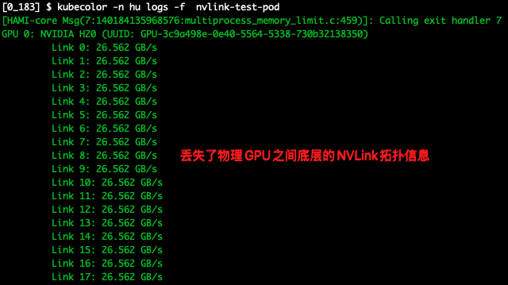
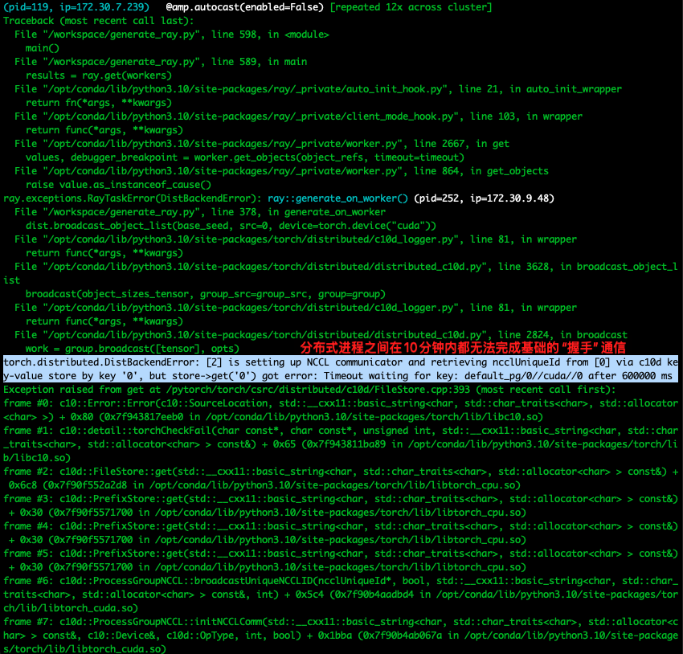

## 1. 问题现象

- **应用类型**: 一个使用 PyTorch FSDP (Fully Sharded Data Parallelism) 策略的文生视频（Text-to-Video）分布式推理任务。
- **基准性能**: 在一台本地的、拥有 8 块物理 GPU 的服务器上，完成一次推理任务耗时约 **6分钟**。
- **观测性能**: 在使用 Hami vGPU 的 k8s 集群上，无论使用 1 个 vGPU 还是 4 个vGPU 甚至 10 个vGPU，完成相同的推理任务耗时均在 **25-30 分钟**左右。性能没有随GPU数量增加而提升，且远慢于基准性能。

## 2. 证据

为了最终证实Hami是导致问题的根源，我们部署了一个申请标准物理GPU（`nvidia.com/gpu: 1`）的测试Pod `nvlink-test-pod`。我们观察到以下关键现象：

1. **NVLink拓扑丢失**: `kubectl logs nvlink-test-pod`的日志（即容器内`nvidia-smi nvlink -s`的输出）**只显示了单张GPU的信息**，而不是像在宿主机上那样显示出8块GPU互相连接的完整矩阵。

   

2. 在为 RayCluster 容器注入`NCCL_DEBUG=INFO`环境变量后，分布式任务在初始化时直接报错，日志显示`Timeout waiting for key`。这证明了分布式进程之间在10分钟内都无法完成基础的“握手”通信。

   

## 3. 根本原因总结

**Hami 的 vGPU 实现，在为容器提供 CUDA 算力的同时，丢失了物理 GPU 之间底层的 NVLink 拓扑信息。这使得容器内的 NCCL 库无法利用高速的 NVLink 总线进行通信，被迫降级到基于 TCP/IP 的慢速容器网络。对于 FSDP 这类通信密集型的分布式策略，这种降级是致命的，其产生的巨大通信延迟是导致应用性能崩溃的唯一原因。**

```yaml
# nvlink-test-pod.yaml
apiVersion: v1
kind: Pod
metadata:
  name: nvlink-test-pod
spec:
  restartPolicy: Never
  containers:
  - name: test
    image: 172.31.0.182/system_containers/pytorch:2.9.0-cuda12.8-cudnn9-devel
    command: ["/bin/sh", "-c", "nvidia-smi nvlink -s"]
    resources:
      limits:
        nvidia.com/gpu: 1
  tolerations:
  - key: "nvidia.com/gpu"
    operator: "Exists"
    effect: "NoSchedule"
```
