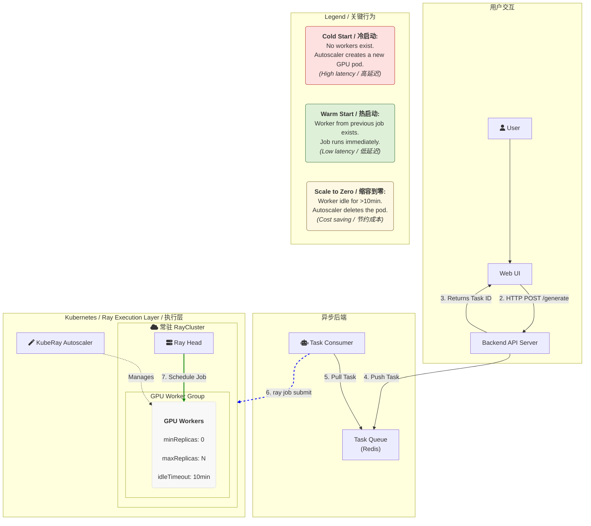

# 体验中心架构：`RayCluster` + `RayJob` + 任务队列

本文档描述了视频生成体验中心基于 `RayCluster` + `RayJob` 的异步、弹性、高性价比的后端架构。该架构旨在解决视频生成任务长耗时、资源密集、请求量不稳定的挑战。

## 1. 架构分层



### 1.1. 接入层 (Access Layer)

这一层负责直接面向用户，提供标准的、异步的 API 接口。

#### 1.1.1. 网关路由

网关 (Gateway) 负责认证、限流，并将所有任务相关的 API 请求路由到后端的 API 服务。核心路由包括：
-   `POST /v1/video/generations`: 提交新的生成任务。
-   `GET /v1/video/generations/{task_id}`: 查询任务状态和结果。
-   `DELETE /v1/video/generations/{task_id}`: 取消或删除任务。

#### 1.1.2. 接口设计

接口设计保持不变，采用异步提交、轮询查询的模式。

-   **提交任务**: 用户调用 `POST /v1/video/generations`，请求体包含模型、prompt、图片等参数。后端**立即**返回一个 `task_id`，并将任务状态置为 `QUEUED`。
-   **查询任务**: 用户使用 `task_id` 轮询 `GET /v1/video/generations/{task_id}` 接口，获取任务的实时状态 (`QUEUED`, `RUNNING`, `SUCCEEDED`, `FAILED`)、进度和最终结果。

*(此处的具体接口参数、响应等与原文档一致，故省略)*

### 1.2. 异步任务与调度层 (Asynchronous Task & Scheduling Layer)

这是新架构的核心，负责将前端的同步 HTTP 请求解耦为后端的异步计算任务。

#### 1.2.1. 核心组件

1.  **后端 API (Backend API)**
    -   **职责**: 接收网关转发的请求，进行参数校验。
    -   **工作**: 不执行任何计算密集型操作。它将请求参数（prompt, image_url 等）打包成一个任务消息，推送到任务队列中，然后立即向用户返回 `task_id`。

2.  **任务队列 (Task Queue)**
    -   **技术选型**: Redis Stream, RabbitMQ, 或其他任何可靠的消息队列。
    -   **职责**: 作为后端 API 和任务消费者之间的缓冲，实现请求的削峰填谷，并确保任务不会丢失。

3.  **任务消费者 (Task Consumer)**
    -   **形式**: 一个独立的、长期运行的 Kubernetes Deployment。
    -   **职责**: 它的唯一工作就是循环地从任务队列中拉取待处理的任务。
    -   **工作**: 每拉取一个任务，就根据任务参数动态生成一个 `RayJob` YAML，并通过 `ray job submit` CLI 或 Ray Job Go SDK 将其提交到预先部署好的 `RayCluster`。

### 1.3. 执行层：可伸缩的 RayCluster

这是实际执行计算任务的地方，其核心是成本效益和响应速度的平衡。

#### 1.3.1. 弹性 RayCluster 配置

我们部署一个**长期运行**的 `RayCluster`，但它的 Worker 节点是**按需、弹性**的。

-   **核心配置**:
    -   `enableInTreeAutoscaling: true`: 开启 KubeRay 的自动伸缩能力。
    -   `minReplicas: 0`: 允许 GPU worker 节点的数量缩减到 0。
    -   `maxReplicas: N`: 定义 GPU worker 节点数量的上限。
    -   `annotations`: `"ray.io/worker-group-idle-timeout-seconds": "600"`: 当一个 worker pod 空闲时间超过 10 分钟，Autoscaler 会自动将其销毁。

-   **优势**:
    -   **成本**: 没有任务时，GPU worker 数量为 0，不产生任何 GPU 资源成本。
    -   **效率**: 在连续请求的场景下（10分钟内），后来的任务可以复用之前任务创建的“温热”的 worker pod，实现毫秒级的任务启动，极大提升用户体验。

**`RayCluster` 配置示例 (`wan22-ray-cluster.yaml`)**:
```yaml
apiVersion: ray.io/v1
kind: RayCluster
metadata:
  name: wan22-ray-cluster
  annotations:
    ray.io/worker-group-idle-timeout-seconds: "600"
spec:
  rayVersion: '2.10.0'
  enableInTreeAutoscaling: true
  headGroupSpec:
    serviceType: NodePort
    rayStartParams:
      dashboard-host: '0.0.0.0'
    template:
      spec:
        containers:
          - name: ray-head
            image: 172.31.0.182/system_containers/wan22:1016-ray
            # ... 其他配置
            resources:
              limits:
                nvidia.com/gpu: "2"
              requests:
                nvidia.com/gpu: "2"
        # ... 其他配置
  workerGroupSpecs:
    - replicas: 0
      minReplicas: 0
      maxReplicas: 3
      groupName: gpu-worker-group
      rayStartParams: { }
      template:
        spec:
          containers:
            - name: ray-worker
              image: 172.31.0.182/system_containers/wan22:1016-ray
              # ... 其他配置
              resources:
                limits:
                  nvidia.com/gpu: "2"
                requests:
                  nvidia.com/gpu: "2"
          # ... 其他配置
```

#### 1.3.2. RayJob 任务提交

任务消费者将任务参数渲染成一个 `RayJob` YAML，并提交到上述 `RayCluster`。

-   **核心配置**:
    -   `clusterSelector`: 通过 `ray.io/cluster: wan22-ray-cluster` 来精确指定任务在哪个已经存在的 `RayCluster` 上运行。
    -   `entrypoint`: 定义了实际执行视频生成的 Python 脚本和参数。

**`RayJob` 配置示例 (`wan22-rayjob-on-exist-cluster.yaml`)**:
```yaml
apiVersion: ray.io/v1
kind: RayJob
metadata:
  name: wan22-rayjob-on-exist-cluster
spec:
  clusterSelector:
    ray.io/cluster: wan22-ray-cluster
  entrypoint: python generate_ray.py --task t2v-A14B --size "832*480" --ckpt_dir /models/Wan2.2-T2V-A14B --num-workers 4 --prompt "A cinematic video of an astronaut on Mars."
  shutdownAfterJobFinishes: false
  # ... 其他参数
```

## 2. 一次完整的视频生成过程

1.  **用户提交**: 用户在前端界面点击“生成”。
2.  **任务入队**: 后端 API 接收请求，将任务参数（prompt 等）放入 Redis 任务队列，并立即返回 `task_id`。
3.  **消费者拉取**: 任务消费者从 Redis 队列中拉取到该任务。
4.  **提交 Job**: 消费者根据任务参数生成一个 `RayJob`，并提交到 Kubernetes。
5.  **RayCluster 响应**:
    -   **冷启动**: 如果此时没有 GPU worker pod，KubeRay Autoscaler 会在几分钟内创建一个新的 worker pod。
    -   **热启动**: 如果 10 分钟内有其他任务刚执行完，此时会有一个“温热”的 worker pod 存在，`RayJob` 会被立即调度到该 pod 上执行。
6.  **任务执行**: `RayJob` 的 `entrypoint` 脚本 (`generate_ray.py`) 在 worker pod 上开始执行，进行耗时数分钟的视频生成计算。
7.  **进度与结果上报**: (可选，但推荐) `generate_ray.py` 脚本可以通过 Redis 或其他方式，将计算进度（如 10%, 20%...）和最终的视频 S3 URL 写回。
8.  **结果查询**: 用户前端通过轮询 `GET /v1/video/generations/{task_id}` 接口，后端 API 从 Redis 或数据库中查询任务的实时进度和最终结果，并返回给用户。
