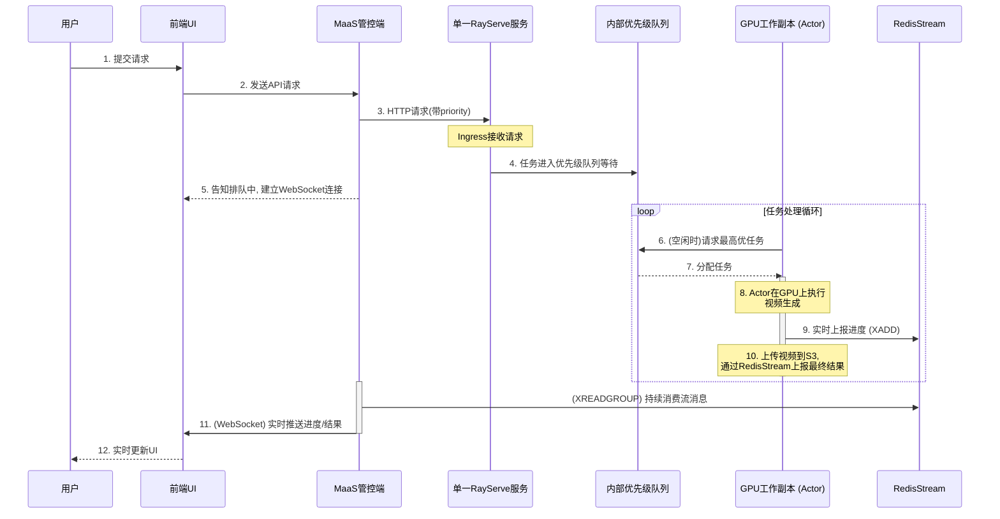

## 1. 架构分层

### 1.1. 接入层

#### 1.1.1 网关路由

这一层的职责是直接接收用户/客户端请求，并对请求进行权限的认证和校验，以及请求的限流（RPM、TPM）控制。

网关的职责不再是直接连接到模型，而是作为“MaaS 管控端”的 API 代理。所有与任务相关的请求都将通过网关路由到管控端。

我们需要定义至少三个核心路由：

1.  **任务提交 API**：用于创建新的视频生成任务。
2.  **任务状态 API**：用于查询已提交任务的状态和结果。
3.  **任务取消/删除 API**：用于取消或删除已提交任务。

**airbrix 默认路由：**

```yaml
apiVersion: gateway.networking.k8s.io/v1
kind: HTTPRoute
metadata:
  name: aibrix-reserved-router
  namespace: aibrix-system
spec:
  parentRefs:
    - name: aibrix-eg
  rules:
    - matches:
        - path:
            type: PathPrefix
            value: /v1/chat/completions
        - path:
            type: PathPrefix
            value: /v1/completions
        - path:
            type: PathPrefix
            value: /v1/embeddings
        - path:
            type: PathPrefix
            value: /v1/image/generations
        # 视频生成
        - path:
            type: PathPrefix
            value: /v1/video/generations
      backendRefs:
        - name: aibrix-gateway-plugins
          port: 50052
```


#### 1.1.2 接口设计

##### 1. 视频生成-基于文本或首帧

POST https://<GATEWAY-IP>/v1/video/generations

```bash
curl --location 'https://<GATEWAY-IP>/v1/video/generations' \
    -H "Authorization: Bearer $API_KEY" \
    -H 'Content-Type: application/json' \
    -d '{
    "model": "wan2.2-i2v",
    "type": "image_to_video",
    "input": {
        "prompt": "一只猫在草地上奔跑",
        "image": "data:image/png;base64,aHR0******cG5n"
    },
    "parameters": {
        "resolution": "720P",
        "prompt_extend": false
    }
}'
```

- **prompt** `*string*` **（必选）**：支持中英文，每个汉字/字母占一个字符，超过部分会自动截断。长度不超过800个字符。

- **negative_prompt** `*string*` （可选）：
  反向提示词，用来描述不希望在视频画面中看到的内容，可以对视频画面进行限制。

  支持中英文，长度不超过500个字符，超过部分会自动截断。

  示例值：低分辨率、错误、最差质量、低质量、残缺、多余的手指、比例不良等。

- **image** `*string*` **（必选）**

  - 首帧图像的 URL 或 Base64 编码数据。

  - 图像限制：

    - 图像格式：JPEG、JPG、PNG（不支持透明信道）、BMP、WEBP。
    - 图像分辨率：图像的宽度和高度范围为[360, 2000]，单位为像素。
    - 文档大小：不超过10MB。

  - 输入图像说明：

    1. 使用公网可访问URL
       - 支持 HTTP 或 HTTPS 协议。
       - 示例值：`https://cdn.translate.alibaba.com/r/wanx-demo-1.png`。
    2. 传入 Base64 编码图像后的字符串
       - 数据格式：`data:{MIME_type};base64,{base64_data}`。
       - 示例值：`data:image/png;base64,GDU7MtCZzEbTbmRZ......`。（编码字符串过长，仅展示片段）

  - **resolution** `*string*` （可选）

    - 用于指定生成的视频分辨率档位。仅用于调整视频的清晰度（总像素），不改变视频的宽高比，**视频宽高比将与输入图像 img_url 的宽高比保持一致**。

      此参数的默认值和可用枚举值依赖于 model 参数，规则如下：

      - wan2.2：可选值：480P、720P、1080P。默认值为`480P`。

  - **duration** `*integer*` （可选）

    - 生成视频的时长，单位为秒。该参数的取值依赖于 model参数：
      - wan2.2：固定为5秒，且不支持修改。

  - **prompt_extend** `*boolean*` （可选）

    是否开启prompt智能改写。开启后使用大模型对输入prompt进行智能改写。对于较短的prompt生成效果提升明显，但会增加耗时。

    - true：默认值，开启智能改写。
    - false：不开启智能改写。

  - **watermark** `*boolean*` （可选）

    是否添加水印标识，水印位于视频右下角，文案固定为“AI生成”。

    - false：默认值，不添加水印。
    - true：添加水印。

  - **seed** `*integer*` （可选）

    随机数种子，取值范围为`[0, 2147483647]`。

    未指定时，系统自动生成随机种子。若需提升生成结果的可复现性，建议固定seed值。

    请注意，由于模型生成具有概率性，即使使用相同 seed，也不能保证每次生成结果完全一致。

    

**正常响应参数**

```bash
{
    "output": {
        "task_status": "QUEUED",
        "task_id": "0385dc79-5ff8-4d82-bcb6-xxxxxx" // 任务ID。查询有效期24小时。
    },
    "request_id": "4909100c-7b5a-9f92-bfe5-xxxxxx"
}
```

- **task_status** `*string*`（任务状态）
  - QUEUED：任务排队中
  - RUNNING：任务处理中
  - SUCCEEDED：任务执行成功
  - FAILED：任务执行失败
  - CANCELED：任务已取消
  - UNKNOWN：任务不存在或状态未知

**异常响应参数**

```bash
{
    "code":"InvalidApiKey",
    "message":"Invalid API-key provided.",
    "request_id":"fb53c4ec-1c12-4fc4-a580-xxxxxx"
}
```


##### 2. 取消或删除任务

```bash
curl -X DELETE https://<GATEWAY-IP>/api/v1/video/generations/$TASK_ID \
  -H "Content-Type: application/json" \
  -H "Authorization: Bearer $API_KEY"
```

任务状态不同，调用 DELETE 接口，执行的操作有所不同，具体说明如下：

| 当前任务状态 | 支持DELETE操作           | 操作含义                                  | DELETE操作后任务状态 |
| ------------ | ------------------------ | ----------------------------------------- | -------------------- |
| QUEUED       | 是                       | 任务取消排队，任务状态被变更为 CANCELED。 | CANCELED             |
| RUNNING      | 不支持                   | -                                         | -                    |
| SUCCEEDED    | 是                       | 删除视频生成任务记录，后续将不支持查询。  | -                    |
| FAILED       | 是                       | 删除视频生成任务记录，后续将不支持查询。  | -                    |
| CANCELED     | 不支持，24小时后自动删除 | -                                         | -                    |


##### 3. 根据任务ID查询结果

GET https://<GATEWAY-IP>/v1/video/generations/{TASK_ID}

- **轮询建议**：视频生成过程约需数分钟，建议采用**轮询**机制，并设置合理的查询间隔（如 15 秒）来获取结果。
- **任务状态流转**：QUEUED（排队中）→ RUNNING（处理中）→ SUCCEEDED（成功）/ FAILED（失败）。
- **结果链接**：任务成功后返回视频链接，有效期为 **24 小时**。建议在获取链接后立即下载并转存至永久存储（如对象存储）。
- **task_id 有效期**：**24小时**，超时后将无法查询结果，接口将返回任务状态为`UNKNOWN`。

```bash
curl -X GET https://<GATEWAY-IP>/api/v1/video/generations/tasks/86ecf553-d340-4e21-xxxxxxxxx \
--header "Authorization: Bearer $API_KEY"
```

任务执行成功响应：

> 视频 URL 仅保留 24 小时，超时后会被自动清除，请及时保存生成的视频。

```bash
{
    "success": true,
    "code": 200,
    "data": {
        "id": 514465659,
        "gmtCreate": "2025-10-25 10:51:37",
        "gmtCreateTimeStamp": 1761360697000,
        "submit_time": "2025-10-25 11:07:28.590",
        "scheduled_time": "2025-10-25 11:07:35.349",
        "completed_time": null,
        "model": "Wan2.2-T2V-14B",
        "taskId": "c7ac5c50cc6643d6a4ee50134548522a",
        "taskStatus": "RUNNING",
        "taskInput": {
            "prompt": "一个金发碧眼的女性站在复古建筑前，背景是，广角镜头，拉出的宏大场景，晴天光，微风吹起裙摆，画面充满复古与优雅气息，镜头拉远，复古胶片风格。",
            "actual_prompt": null, // 开启 prompt 智能改写后，返回实际使用的优化后 prompt。若未开启该功能，则不返回此字段。
            "resolution": "720", // 生成视频的分辨率。枚举值为480、720、1080。
            "duration": 5,  // 计费公式：费用 = 视频秒数 × 单价。
            "video_count": 1, // 生成视频的数量。固定为1。
            "video_url": null,
            "seed": 10, // 随机数种子，用于控制生成内容的随机性。取值范围 `[0, 2147483647]`。不提供则自动生成。相同 seed 可能复现相似结果。
        },
        "taskType": "text_to_video",
        "taskProgress": 97, // 任务进度
        "mediaType": "video"
    },
    "requestId": "9d126a34e4cee3b08c02874cd9a5268f",
    "failed": false
}
```


任务执行失败：

```bash
{
    "request_id": "e5d70b02-ebd3-98ce-9fe8-759d7d7b107d",
    "data": {
        "task_id": "86ecf553-d340-4e21-af6e-a0c6a421c010",
        "task_status": "FAILED",
        "code": "InvalidParameter",
        "message": "The size is not match xxxxxx"
    }
}
```


任务查询过期：

> task_id查询有效期为 24 小时，超时后将无法查询，返回以下报错信息。

```bash
{
    "request_id": "a4de7c32-7057-9f82-8581-xxxxxx",
    "data": {
        "task_id": "502a00b1-19d9-4839-a82f-xxxxxx",
        "task_status": "UNKNOWN"
    }
}
```


### 1.2. 控制层——MaaS 管控端

在转为常驻服务模式后，管控端的职责发生了根本性转变。它不再是创建和管理批处理作业的“工厂”，而是作为一个**智能的API网关和请求路由器**，直接与后端的 RayServe 推理服务集群进行通信。

#### 1.2.1. 核心职责

1.  **认证与授权**：接收来自接入层网关的请求，校验用户身份和API Key的有效性。
2.  **任务持久化与状态管理**：生成全局唯一的 `task_id`，并将任务的初始信息（如prompt、用户ID、状态=`QUEUED`）存入数据库。
3.  **服务路由与QoS分发**：根据用户等级或请求参数，判断该请求应被发送到哪个后端的 RayServe 集群（如“高优先级集群”或“普通集群”），实现服务质量（QoS）的差异化。
4.  **异步任务提交**：通过 HTTP/gRPC 协议，将生成请求**直接提交**给目标 RayServe 服务的入口点（Ingress）。RayServe 服务自身被设计为异步处理，会立即返回确认信息，而生成过程则在后端集群中异步执行。

**请求转发示例 (Python)**:
```python
# 管控端内部逻辑示例
async def submit_task_to_rayserve(user_request: dict, user_tier: str):
    task_id = generate_unique_task_id()
    
    # 根据用户等级选择目标服务
    if user_tier == "premium":
        rayserve_endpoint = "http://rayservice-premium.ray-namespace.svc/generate"
    else:
        rayserve_endpoint = "http://rayservice-default.ray-namespace.svc/generate"
        
    # 构造提交给 RayServe 的请求体
    rayserve_payload = {
        "task_id": task_id,
        "prompt": user_request.get("prompt"),
        "image_url": user_request.get("input", {}).get("img_url"),
        # ... 其他参数
    }
    
    # 将任务信息预存入数据库
    await db.save_task(task_id, status="QUEUED", payload=rayserve_payload)
    
    # 异步调用 RayServe 服务
    async with httpx.AsyncClient() as client:
        response = await client.post(rayserve_endpoint, json=rayserve_payload, timeout=10)
        response.raise_for_status() # 确保请求被成功接收
        
    # RayServe 已接收任务，向用户返回 task_id
    return {"task_id": task_id, "task_status": "QUEUED"}
```

### 1.3. QoS保障: 单一资源池与内部优先级队列

您提出的“多Deployment会造成资源闲置”是一个非常关键且实际的问题。固定地为不同等级的用户预留资源（GPU），必然导致在“高级用户请求量低、普通用户请求量高”时，大量为高级用户预留的GPU处于闲置状态，而普通用户却在长时间排队。

为了解决这个问题，实现极致的资源利用率，我们采用一种更高级、更动态的模式：**在单一`RayService`内，构建一个统一的GPU资源池，并通过应用层的“优先级队列”来进行任务调度**。

这种模式下，任何一个空闲的GPU都可以被用来处理当前队列中优先级最高的任务，从而确保资源利用率最大化。

**核心架构与流程**:

1.  **统一资源池 (Single Deployment)**: 在`RayService`中只定义一个`Deployment`，例如`generator-deployment`。这个Deployment会管理集群中所有可用的GPU资源，形成一个统一的计算资源池。

2.  **中心化优先级队列 (Priority Queue)**: 这是本方案的核心。我们在Ray Serve应用内部实现一个中心化的任务队列（例如，使用`asyncio.PriorityQueue`）。这个队列并非先进先出（FIFO），而是根据任务的优先级进行排序。

3.  **MaaS管控端**: 管控端在转发请求时，必须在请求体中加入一个`priority`字段（例如，高级用户为1，普通用户为10）。

4.  **Ray Serve内部工作流**:
    *   **入口 (Ingress)**: Ray Serve的HTTP入口接收到请求后，**不直接执行任务**。它将请求（包含优先级和数据）封装成一个任务对象，放入中心化的**优先级队列**中，然后立即向管控端返回`task_id`。
    *   **工作副本 (Worker Replicas)**: `generator-deployment`的每个副本（Actor）在完成一个任务后，不会从默认队列取任务，而是主动向“优先级队列”请求下一个任务。队列会自动弹出当前优先级最高的任务（`priority`值最小）。
    *   **执行**: 工作副本在获得任务后，在自己的GPU上开始执行视频生成。执行完毕后，再次向队列请求任务，如此循环。

**`serveConfigV2` 配置示例**:
```yaml
# 单一RayService，单一Deployment，构成统一资源池
apiVersion: ray.io/v1
kind: RayService
metadata:
  name: wan22-rayservice
spec:
  rayClusterConfig: # 定义整个集群的总资源
    # ...
    workerGroupSpecs:
    - groupName: gpu-workers
      replicas: 5 
      template:
        spec:
          containers:
          - name: ray-worker
            resources:
              limits:
                nvidia.com/gpu: "2" # 总共10个GPU
  
  serveConfigV2: |
    applications:
      - name: wan22
        import_path: serve_app:app 
        deployments:
          - name: generator-deployment # 唯一的Deployment
            num_replicas: 5 # 5个副本，每个副本2个GPU，用满所有资源
            ray_actor_options:
              num_gpus: 2
```

任务提交流程图：
```mermaid
graph TD
    subgraph MaaS 管控端
        A[Controller API]
    end
    subgraph 单一 RayService 实例
        B(HTTP Ingress)
        C{{Priority Queue<br/>(Scheduler Actor)}}
        subgraph 统一GPU资源池 (generator-deployment)
            W1(Worker 1<br/>GPU 0, 1)
            W2(Worker 2<br/>GPU 2, 3)
            W3(...)
            Wn(Worker 5<br/>GPU 8, 9)
        end
    end
    
    User -- "请求 (priority=10)" --> A
    A -- "HTTP POST /generate" --> B
    B -- "1. 将任务放入队列" --> C
    W1 -- "2. 请求下一个任务" --> C
    C -- "3. 弹出最高优先级任务" --> W1
    W1 -- "4. 在GPU上执行" --> W1
    W1 -- "5. 完成后，再次请求任务" --> C
```

**优势与权衡**:

-   **最大化资源利用率**: 这是此方案的最大优势。任何空闲的GPU都可以立即投入使用，服务于当前最紧急的任务，避免了因资源划分而导致的“旱涝不均”。
-   **真正的优先级调度**: 保证了高优先级用户的请求总是在等待队列中处于领先位置，只要有任何一个GPU被释放，就能被优先处理。
-   **复杂性**: 此方案的缺点是实现复杂度较高。它要求在Ray Serve应用代码中手动实现任务队列、调度逻辑和工作副本的拉取循环，对开发者的要求更高。
-   **关于抢占**: 与之前的方案一样，此方案同样实现了**优先级调度**，而非**任务抢占**。一个已经开始在GPU上运行的低优先级任务不会被中断。但考虑到实现的简易性和系统的稳定性，这通常是最佳的、也是最实际的权衡。

### 1.4. 推理服务执行层


这一层由 `RayService` 和其管理的 `RayCluster` 构成，是实际执行计算密集型推理任务的核心。


-   **统一资源池**: 与之前通过多Deployment划分资源的方式不同，现在所有的 Worker Pod 和 GPU 都属于同一个 `Deployment`，形成一个统一的、无差别的计算资源池。任何一个工作副本（Actor）都可以处理任何优先级的任务。

-   **应用层调度**: 任务的优先级调度完全在 Ray Serve 应用代码内部通过“优先级队列”实现。这使得调度策略非常灵活，但同时也对应用本身的健壮性提出了更高要求。

-   **任务执行**: Ray Serve 的工作副本（Actor）以“拉取模式”工作。它们在空闲时，会主动从中心任务队列中拉取当前优先级最高的任务来执行，执行完毕后再次拉取。这确保了GPU资源始终被用于处理最紧急的计算任务。


## 2. 一次完整的视频生成过程


下面是采用“内部优先级队列”方案的、新的端到端工作流：





采用“内部优先级队列”后的用户请求流程：


1.  **用户提交**: 用户在前端界面输入 prompt，上传图片，点击“生成”。

2.  **请求处理与优先级注入**: MaaS 管控端的 API 服务接收到请求。它识别用户身份，生成 `task_id`，并根据用户等级在请求体中**注入 `priority` 字段**。随后，将任务信息存入数据库。

3.  **提交到服务入口**: 管控端向单一的 `RayService` 服务入口发起 HTTP 请求。

4.  **入队等待**: `RayService` 的 HTTP 入口接收到请求后，将其封装并放入一个**内部的优先级队列**中，然后立即向管控端返回确认信息。

5.  **建立实时通道**: 前端与管控端建立 **WebSocket** 连接，用于接收实时通知。

6.  **工作副本拉取任务**: 集群中任一空闲的 GPU 工作副本（Actor）会向优先级队列请求任务，队列将当前优先级最高的任务弹出并分配给它。

7.  **异步执行与进度上报**: Actor 在自己的 GPU 上开始执行耗时的视频生成任务，并通过 **Redis Stream** 实时汇报进度。

8.  **结果后处理与通知**: 任务完成后，Actor 将生成的视频上传到 S3，并通过 Redis Stream 发送“完成”消息。

9.  **结果推送**: 管控端监听到 Redis Stream 的消息，通过 WebSocket 将进度和最终结果实时推送给前端。

10. **前端 UI**: 前端根据收到的实时消息，更新界面上的进度条，并最终向用户展示生成的视频。


## 参考

- https://bailian.console.alibabacloud.com/?tab=api#/api/?type=model&url=2867393
- https://www.volcengine.com/docs/82379/1520757