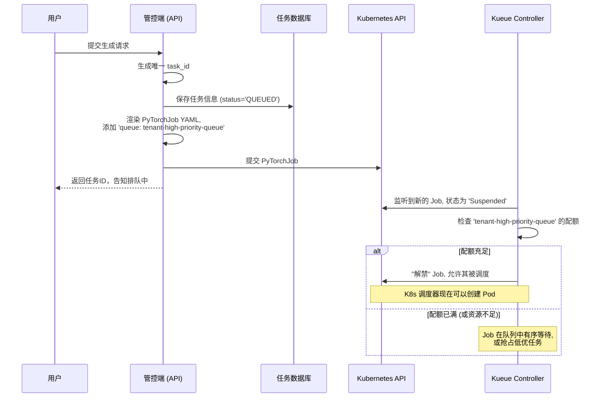
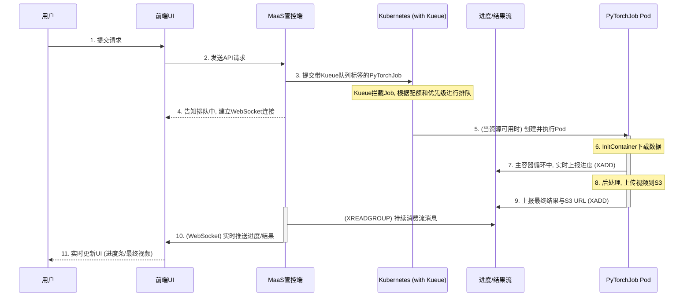

## 1. 架构分层

### 1.1. 接入层

#### 1.1.1 网关路由

这一层的职责是直接接收用户/客户端请求，并对请求进行权限的认证和校验，以及请求的限流（RPM、TPM）控制。

网关的职责不再是直接连接到模型，而是作为“MaaS 管控端”的 API 代理。所有与任务相关的请求都将通过网关路由到管控端。

我们需要定义至少三个核心路由：

1.  **任务提交 API**：用于创建新的视频生成任务。
2.  **任务状态 API**：用于查询已提交任务的状态和结果。
3.  **任务取消/删除 API**：用于取消或删除已提交任务。

**airbrix 默认路由：**

```yaml
apiVersion: gateway.networking.k8s.io/v1
kind: HTTPRoute
metadata:
  name: aibrix-reserved-router
  namespace: aibrix-system
spec:
  parentRefs:
    - name: aibrix-eg
  rules:
    - matches:
        - path:
            type: PathPrefix
            value: /v1/chat/completions
        - path:
            type: PathPrefix
            value: /v1/completions
        - path:
            type: PathPrefix
            value: /v1/embeddings
        - path:
            type: PathPrefix
            value: /v1/image/generations
        # 视频生成
        - path:
            type: PathPrefix
            value: /v1/video/generations
      backendRefs:
        - name: aibrix-gateway-plugins
          port: 50052
```


#### 1.1.2 接口设计

##### 1. 视频生成-基于文本或首帧

POST https://<GATEWAY-IP>/v1/video/generations

```bash
curl --location 'https://<GATEWAY-IP>/v1/video/generations' \
    -H "Authorization: Bearer $API_KEY" \
    -H 'Content-Type: application/json' \
    -d '{
    "model": "wan2.2-i2v",
    "type": "image_to_video",
    "input": {
        "prompt": "一只猫在草地上奔跑",
        "image": "data:image/png;base64,aHR0******cG5n"
    },
    "parameters": {
        "resolution": "720P",
        "prompt_extend": false
    }
}'
```

- **prompt** `*string*` **（必选）**：支持中英文，每个汉字/字母占一个字符，超过部分会自动截断。长度不超过800个字符。

- **negative_prompt** `*string*` （可选）：
  反向提示词，用来描述不希望在视频画面中看到的内容，可以对视频画面进行限制。

  支持中英文，长度不超过500个字符，超过部分会自动截断。

  示例值：低分辨率、错误、最差质量、低质量、残缺、多余的手指、比例不良等。

- **image** `*string*` **（必选）**

  - 首帧图像的 URL 或 Base64 编码数据。

  - 图像限制：

    - 图像格式：JPEG、JPG、PNG（不支持透明信道）、BMP、WEBP。
    - 图像分辨率：图像的宽度和高度范围为[360, 2000]，单位为像素。
    - 文档大小：不超过10MB。

  - 输入图像说明：

    1. 使用公网可访问URL
       - 支持 HTTP 或 HTTPS 协议。
       - 示例值：`https://cdn.translate.alibaba.com/r/wanx-demo-1.png`。
    2. 传入 Base64 编码图像后的字符串
       - 数据格式：`data:{MIME_type};base64,{base64_data}`。
       - 示例值：`data:image/png;base64,GDU7MtCZzEbTbmRZ......`。（编码字符串过长，仅展示片段）

  - **resolution** `*string*` （可选）

    - 用于指定生成的视频分辨率档位。仅用于调整视频的清晰度（总像素），不改变视频的宽高比，**视频宽高比将与输入图像 img_url 的宽高比保持一致**。

      此参数的默认值和可用枚举值依赖于 model 参数，规则如下：

      - wan2.2：可选值：480P、720P、1080P。默认值为`480P`。

  - **duration** `*integer*` （可选）

    - 生成视频的时长，单位为秒。该参数的取值依赖于 model参数：
      - wan2.2：固定为5秒，且不支持修改。

  - **prompt_extend** `*boolean*` （可选）

    是否开启prompt智能改写。开启后使用大模型对输入prompt进行智能改写。对于较短的prompt生成效果提升明显，但会增加耗时。

    - true：默认值，开启智能改写。
    - false：不开启智能改写。

  - **watermark** `*boolean*` （可选）

    是否添加水印标识，水印位于视频右下角，文案固定为“AI生成”。

    - false：默认值，不添加水印。
    - true：添加水印。

  - **seed** `*integer*` （可选）

    随机数种子，取值范围为`[0, 2147483647]`。

    未指定时，系统自动生成随机种子。若需提升生成结果的可复现性，建议固定seed值。

    请注意，由于模型生成具有概率性，即使使用相同 seed，也不能保证每次生成结果完全一致。

    

**正常响应参数**

```bash
{
    "output": {
        "task_status": "QUEUED",
        "task_id": "0385dc79-5ff8-4d82-bcb6-xxxxxx" // 任务ID。查询有效期24小时。
    },
    "request_id": "4909100c-7b5a-9f92-bfe5-xxxxxx"
}
```

- **task_status** `*string*`（任务状态）
  - QUEUED：任务排队中
  - RUNNING：任务处理中
  - SUCCEEDED：任务执行成功
  - FAILED：任务执行失败
  - CANCELED：任务已取消
  - UNKNOWN：任务不存在或状态未知

**异常响应参数**

```bash
{
    "code":"InvalidApiKey",
    "message":"Invalid API-key provided.",
    "request_id":"fb53c4ec-1c12-4fc4-a580-xxxxxx"
}
```


##### 2. 取消或删除任务

```bash
curl -X DELETE https://<GATEWAY-IP>/api/v1/video/generations/$TASK_ID \
  -H "Content-Type: application/json" \
  -H "Authorization: Bearer $API_KEY"
```

任务状态不同，调用 DELETE 接口，执行的操作有所不同，具体说明如下：

| 当前任务状态 | 支持DELETE操作           | 操作含义                                  | DELETE操作后任务状态 |
| ------------ | ------------------------ | ----------------------------------------- | -------------------- |
| QUEUED       | 是                       | 任务取消排队，任务状态被变更为 CANCELED。 | CANCELED             |
| RUNNING      | 不支持                   | -                                         | -                    |
| SUCCEEDED    | 是                       | 删除视频生成任务记录，后续将不支持查询。  | -                    |
| FAILED       | 是                       | 删除视频生成任务记录，后续将不支持查询。  | -                    |
| CANCELED     | 不支持，24小时后自动删除 | -                                         | -                    |


##### 3. 根据任务ID查询结果

GET https://<GATEWAY-IP>/v1/video/generations/{TASK_ID}

- **轮询建议**：视频生成过程约需数分钟，建议采用**轮询**机制，并设置合理的查询间隔（如 15 秒）来获取结果。
- **任务状态流转**：QUEUED（排队中）→ RUNNING（处理中）→ SUCCEEDED（成功）/ FAILED（失败）。
- **结果链接**：任务成功后返回视频链接，有效期为 **24 小时**。建议在获取链接后立即下载并转存至永久存储（如对象存储）。
- **task_id 有效期**：**24小时**，超时后将无法查询结果，接口将返回任务状态为`UNKNOWN`。

```bash
curl -X GET https://<GATEWAY-IP>/api/v1/video/generations/tasks/86ecf553-d340-4e21-xxxxxxxxx \
--header "Authorization: Bearer $API_KEY"
```

任务执行成功响应：

> 视频 URL 仅保留 24 小时，超时后会被自动清除，请及时保存生成的视频。

```bash
{
    "success": true,
    "code": 200,
    "data": {
        "id": 514465659,
        "gmtCreate": "2025-10-25 10:51:37",
        "gmtCreateTimeStamp": 1761360697000,
        "submit_time": "2025-10-25 11:07:28.590",
        "scheduled_time": "2025-10-25 11:07:35.349",
        "completed_time": null,
        "model": "Wan2.2-T2V-14B",
        "taskId": "c7ac5c50cc6643d6a4ee50134548522a",
        "taskStatus": "RUNNING",
        "taskInput": {
            "prompt": "一个金发碧眼的女性站在复古建筑前，背景是，广角镜头，拉出的宏大场景，晴天光，微风吹起裙摆，画面充满复古与优雅气息，镜头拉远，复古胶片风格。",
            "actual_prompt": null, // 开启 prompt 智能改写后，返回实际使用的优化后 prompt。若未开启该功能，则不返回此字段。
            "resolution": "720", // 生成视频的分辨率。枚举值为480、720、1080。
            "duration": 5,  // 计费公式：费用 = 视频秒数 × 单价。
            "video_count": 1, // 生成视频的数量。固定为1。
            "video_url": null,
            "seed": 10, // 随机数种子，用于控制生成内容的随机性。取值范围 `[0, 2147483647]`。不提供则自动生成。相同 seed 可能复现相似结果。
        },
        "taskType": "text_to_video",
        "taskProgress": 97, // 任务进度
        "mediaType": "video"
    },
    "requestId": "9d126a34e4cee3b08c02874cd9a5268f",
    "failed": false
}
```


任务执行失败：

```bash
{
    "request_id": "e5d70b02-ebd3-98ce-9fe8-759d7d7b107d",
    "data": {
        "task_id": "86ecf553-d340-4e21-af6e-a0c6a421c010",
        "task_status": "FAILED",
        "code": "InvalidParameter",
        "message": "The size is not match xxxxxx"
    }
}
```


任务查询过期：

> task_id查询有效期为 24 小时，超时后将无法查询，返回以下报错信息。

```bash
{
    "request_id": "a4de7c32-7057-9f82-8581-xxxxxx",
    "data": {
        "task_id": "502a00b1-19d9-4839-a82f-xxxxxx",
        "task_status": "UNKNOWN"
    }
}
```


### 1.2. 控制层——MaaS 管控端

这一层的职责是接收网关请求，并将其转化为可执行的、可被调度的后端任务。

#### 1.2.1. 任务参数化与模板化

管控端的核心功能之一是作为 `PyTorchJob` 的“工厂”。它内置一个或多个基础的 YAML 文件作为**任务模板**。这些模板包含了 Pod 规格、卷挂载等通用配置。

当接收到请求时，管控端会根据用户租户/身份（如高级用户、普通用户）和请求参数，动态渲染模板，生成最终的 `PyTorchJob` YAML。

**模板占位符与动态渲染示例**:

```yaml
apiVersion: "kubeflow.org/v1"
kind: PyTorchJob
metadata:
  name: wan22-{{TASK_ID}}
spec:
  runPolicy:
    cleanPodPolicy: None # 可选值: All, Running, None. All 表示任务结束后清理所有 Pod
  pytorchReplicaSpecs:
    Master:
      replicas: 1
      restartPolicy: OnFailure
      template:
        spec:
          affinity:
            podAntiAffinity:
              requiredDuringSchedulingIgnoredDuringExecution:
              - labelSelector:
                  matchExpressions:
                  - key: training.kubeflow.org/job-name
                    operator: In
                    values:
                    - wan22-{{TASK_ID}}
                topologyKey: "kubernetes.io/hostname"
          initContainers:
            - name: download-image
              image: 172.31.0.182/system_containers/wan22:1024
              command:
                - "/bin/sh"
                - "-c"
                - |
                  set -e
                  if [ -z "$INPUT_IMAGE_SPEC" ]; then
                    echo "Error: INPUT_IMAGE_SPEC environment variable is not set." >&2
                    exit 1
                  fi
                  OUTPUT_PATH="/image-data/input.jpg"
                  if echo "$INPUT_IMAGE_SPEC" | grep -q -E '^https?://'; then
                    echo "Input is a URL. Downloading..."
                    wget -O "$OUTPUT_PATH" "$INPUT_IMAGE_SPEC"
                  elif echo "$INPUT_IMAGE_SPEC" | grep -q '^data:image/'; then
                    echo "Input is a Base64 data URI. Decoding..."
                    echo "$INPUT_IMAGE_SPEC" | sed 's/^data:image\/[^;]*;base64,//' | base64 -d > "$OUTPUT_PATH"
                  else
                    echo "Error: INPUT_IMAGE_SPEC format not recognized: $INPUT_IMAGE_SPEC" >&2
                    exit 1
                  fi
                  echo "Image successfully processed and saved to $OUTPUT_PATH"
              env:
                - name: INPUT_IMAGE_SPEC
                  value: "https://cdn.translate.alibaba.com/r/wanx-demo-1.png"
              volumeMounts:
                - name: image-volume
                  mountPath: /image-data
          containers:
            - name: pytorch
              image: 172.31.0.182/system_containers/wan22:1024
              imagePullPolicy: Always
              command:
                - "torchrun"
              args:
                - "--nproc_per_node=2"
                - "generate.py"
                - "--task"
                - "i2v-A14B"
                - "--size"
                - "832*480"
                - "--ckpt_dir"
                - "/data/Wan2.2-I2V-A14B"
                - "--image"
                - "/image-data/input.jpg"
                - "--dit_fsdp"
                - "--t5_fsdp"
                - "--convert_model_dtype"
                - "--ulysses_size"
                - "4"
                - "--sample_guide_scale"
                - "10"
                - "--prompt"
                - "刘亦菲和特朗普身着舒适的拳击装备，戴着鲜艳的拳套，在聚光灯照耀的舞台上激烈地搏斗"
                - "--save_file"
                - "/output/wan22-i2v-distributed2.mp4"
                - "--s3_endpoint_url"
                - "https://s3.cn-north-1.qiniucs.com"
                - "--s3_bucket"
                - "wan22"
                - "--s3_key_prefix"
                - "wan22-{{TASK_ID}}"
              resources:
                requests:
                  cpu: "4"
                limits:
                  cpu: "64"
                  memory: 256Gi
                  nvidia.com/gpu: "2"
                  t7d.com/rdma: "1"
              env:
                - name: WAN_FRAME_NUM
                  value: "81"
                - name: NVIDIA_VISIBLE_DEVICES
                  value: "all"
                - name: NCCL_IB_DISABLE
                  value: "0"
                - name: NCCL_SOCKET_IFNAME
                  value: "^lo,docker0,veth"
                - name: AWS_ACCESS_KEY_ID
                  valueFrom:
                    secretKeyRef:
                      name: s3-credentials
                      key: S3_ACCESS_KEY
                - name: AWS_SECRET_ACCESS_KEY
                  valueFrom:
                    secretKeyRef:
                      name: s3-credentials
                      key: S3_SECRET_KEY
              volumeMounts:
                - name: data-volume
                  mountPath: /data/Wan2.2-I2V-A14B
                - name: output-volume
                  mountPath: /output
                - name: dshm
                  mountPath: /dev/shm
                - name: image-volume
                  mountPath: /image-data
          volumes:
            - name: data-volume
              hostPath:
                path: /data/Wan-AI/Wan2.2-I2V-A14B
            - name: output-volume
              hostPath:
                path: /data/Wan-AI/output
            - name: dshm
              emptyDir:
                medium: Memory
                sizeLimit: 128Gi
            - name: image-volume
              emptyDir: {}
    Worker:
      replicas: 1
      restartPolicy: OnFailure
      template:
        spec:
          affinity:
            podAntiAffinity:
              requiredDuringSchedulingIgnoredDuringExecution:
              - labelSelector:
                  matchExpressions:
                  - key: training.kubeflow.org/job-name
                    operator: In
                    values:
                    - wan22-i2v-distributed2-s3
                topologyKey: "kubernetes.io/hostname"
          initContainers:
            - name: download-image
              image: 172.31.0.182/system_containers/wan22:1024
              command:
                - "/bin/sh"
                - "-c"
                - |
                  set -e
                  if [ -z "$INPUT_IMAGE_SPEC" ]; then
                    echo "Error: INPUT_IMAGE_SPEC environment variable is not set." >&2
                    exit 1
                  fi
                  OUTPUT_PATH="/image-data/input.jpg"
                  if echo "$INPUT_IMAGE_SPEC" | grep -q -E '^https?://'; then
                    echo "Input is a URL. Downloading..."
                    wget -O "$OUTPUT_PATH" "$INPUT_IMAGE_SPEC"
                  elif echo "$INPUT_IMAGE_SPEC" | grep -q '^data:image/'; then
                    echo "Input is a Base64 data URI. Decoding..."
                    echo "$INPUT_IMAGE_SPEC" | sed 's/^data:image\/[^;]*;base64,//' | base64 -d > "$OUTPUT_PATH"
                  else
                    echo "Error: INPUT_IMAGE_SPEC format not recognized: $INPUT_IMAGE_SPEC" >&2
                    exit 1
                  fi
                  echo "Image successfully processed and saved to $OUTPUT_PATH"
              env:
                - name: INPUT_IMAGE_SPEC
                  value: "https://cdn.translate.alibaba.com/r/wanx-demo-1.png"
              volumeMounts:
                - name: image-volume
                  mountPath: /image-data
          containers:
            - name: pytorch
              image: 172.31.0.182/system_containers/wan22:1024
              imagePullPolicy: Always
              command:
                - "torchrun"
              args:
                - "--nproc_per_node=2"
                - "generate.py"
                - "--task"
                - "i2v-A14B"
                - "--size"
                - "832*480"
                - "--ckpt_dir"
                - "/data/Wan2.2-I2V-A14B"
                - "--image"
                - "/image-data/input.jpg"
                - "--dit_fsdp"
                - "--t5_fsdp"
                - "--convert_model_dtype"
                - "--ulysses_size"
                - "4"
                - "--sample_guide_scale"
                - "10"
                - "--prompt"
                - "刘亦菲和特朗普身着舒适的拳击装备，戴着鲜艳的拳套，在聚光灯照耀的舞台上激烈地搏斗"
                - "--save_file"
                - "/output/wan22-i2v-distributed2.mp4"
                - "--s3_endpoint_url"
                - "https://s3.cn-north-1.qiniucs.com"
                - "--s3_bucket"
                - "wan22"
                - "--s3_key_prefix"
                - "wan22-i2v-task-20251024112355"
              resources:
                requests:
                  cpu: "4"
                limits:
                  cpu: "64"
                  memory: 256Gi
                  nvidia.com/gpu: "2"
                  t7d.com/rdma: "1"
              env:
                - name: WAN_FRAME_NUM
                  value: "81"
                - name: NVIDIA_VISIBLE_DEVICES
                  value: "all"
                - name: NCCL_IB_DISABLE
                  value: "0"
                - name: NCCL_SOCKET_IFNAME
                  value: "^lo,docker0,veth"
                - name: AWS_ACCESS_KEY_ID
                  valueFrom:
                    secretKeyRef:
                      name: s3-credentials
                      key: S3_ACCESS_KEY
                - name: AWS_SECRET_ACCESS_KEY
                  valueFrom:
                    secretKeyRef:
                      name: s3-credentials
                      key: S3_SECRET_KEY
              volumeMounts:
                - name: data-volume
                  mountPath: /data/Wan2.2-I2V-A14B
                - name: output-volume
                  mountPath: /output
                - name: dshm
                  mountPath: /dev/shm
                - name: image-volume
                  mountPath: /image-data
          volumes:
            - name: data-volume
              hostPath:
                path: /data/Wan-AI/Wan2.2-I2V-A14B
            - name: output-volume
              hostPath:
                path: /data/Wan-AI/output
            - name: dshm
              emptyDir:
                medium: Memory
                sizeLimit: 128Gi
            - name: image-volume
              emptyDir: {}
```

### 1.3. 任务调度与 QoS 保障

为了有效管理昂贵的 GPU 资源，避免因请求突发导致集群超载，我们引入 **Kueue**，一个 Kubernetes 原生的作业排队系统，来实现任务排队、优先级调度、错峰模式、并发控制和差异化服务质量（QoS）。

与自研应用层队列不同，Kueue 将排队和调度能力直接集成到 Kubernetes 基础设施中，使我们能以声明式的方式管理任务。

**核心组件与概念**:

-   **ClusterQueue**: 集群级别的队列。每个队列都可以配置独立的资源配额、抢占策略等。
-   **LocalQueue**: `ClusterQueue` 在具体命名空间中的代理。
-   **ResourceFlavor**: 对物理资源的抽象，例如，我们可以定义一个名为 `h20` 的 flavor 来特指 H20 GPU。

**通过 Kueue 实现差异化 QoS**:

1.  **配额隔离**：为高优先级用户队列分配更多的 GPU 资源。例如，在总共 10 个 GPU 的集群中，我们可以为 `tenant-high-priority-queue` 分配 8 个 GPU 的并发额度，而为 `tenant-low-priority-queue` 只分配 2 个。

    ```yaml
    # 高级用户队列，拥有 8 个 GPU 的配额
    apiVersion: kueue.x-k8s.io/v1beta1
    kind: ClusterQueue
    metadata:
      name: "tenant-high-priority-queue"
    spec:
      resourceGroups:
      - coveredResources: ["nvidia.com/gpu"]
        flavors:
        - name: "default-flavor"
          resources:
          - name: "nvidia.com/gpu"
            nominalQuota: 8
    ---
    # 普通用户队列，拥有 2 个 GPU 的配额
    apiVersion: kueue.x-k8s.io/v1beta1
    kind: ClusterQueue
    metadata:
      name: "tenant-low-priority-queue"
    spec:
      resourceGroups:
      - coveredResources: ["nvidia.com/gpu"]
        flavors:
        - name: "default-flavor"
          resources:
          - name: "nvidia.com/gpu"
            nominalQuota: 2
    ```

2.  **抢占与优先级**：我们可以配置 `tenant-high-priority-queue` 具有抢占能力。当高级用户的任务提交时，如果集群资源已满，Kueue 可以自动“挂起”一个正在运行的、较低优先级的普通任务，以释放资源供高级用户使用。这通过 `priority` 字段和 `preemption` 策略来实现。

任务调度流程图：



**工作流程**:

1.  **接收请求**: 管控端的 API 服务接收到用户请求。
2.  **身份识别与持久化**: 服务识别用户身份（租户/优先级），生成 `task_id`，并将任务信息（如 prompt、用户ID、所选参数、状态=`QUEUED`）存入数据库（如 PostgreSQL）。
3.  **渲染并提交**: 管控端根据用户身份，选择对应的队列名称（`tenant-high-priority-queue` 或 `tenant-low-priority-queue`）和优先级，渲染 `PyTorchJob` YAML 模板，然后**直接将其提交到 Kubernetes API**。
4.  **Kueue 调度**: Kueue 控制器自动拦截这个新提交的 Job，使其处于 `Suspended` (暂停) 状态。Kueue 会根据对应 `ClusterQueue` 的配额和优先级规则，决定何时“解禁”该 Job，允许它被调度和执行。
5.  **返回响应**: API 服务在提交 Job 后，立即向用户返回 `task_id`，告知任务正在排队。

### 1.4. 任务调度与执行层

这一层由 Kueue 和 PyTorchJob 控制器共同构成。

-   **排队与准入**: Kueue 作为准入控制器，决定一个 `PyTorchJob` 是否可以开始执行。
-   **资源创建**: 一旦 Kueue“解禁”一个 `PyTorchJob`，PyTorchJob Controller 就会像原来一样创建对应的 `Master` 和 `Worker` Pods。
-   **Pod 调度与资源分配**: 后续流程不变。Kubernetes Scheduler 和 HAMI vGPU 调度器负责将 Pod 放置到具体节点并分配 vGPU 资源。
-   **任务执行**: Pod 启动后，执行任务脚本。


## 2. 一次完整的视频生成过程

下面是集成了 Kueue 的、新的端到端工作流：



采用 Kueue 后的用户请求流程：

1.  **用户提交**: 用户在前端界面输入 prompt，上传图片，点击“生成”。
2.  **请求处理与提交**: MaaS 管控端的 API 服务接收到请求。它识别用户身份（如高级用户），生成 `task_id`，将任务信息存入**任务数据库**。然后，它使用模板渲染 `PyTorchJob` YAML，**在其中填入正确的队列名称（如 `tenant-high-priority-queue`）和优先级**，并直接将这份 YAML **提交到 Kubernetes API**。管控端立即向前端返回 `task_id`。
3.  **建立实时通道**: 前端与管控端建立 **WebSocket** 连接，用于接收实时通知。
4.  **Kueue 调度**: Kueue 监听到这个新 Job，并根据 `tenant-high-priority-queue` 的配额和当前资源使用情况进行判断。如果队列有空闲资源，Job 就被允许执行；否则，它会在 Kueue 中安全地排队等待，或根据抢占规则为它腾出资源。
5.  **Pod 调度与执行**: 一旦 Kueue 准许，Kubernetes 就会创建 `PyTorchJob` 的 Pods。
6.  **数据注入**: Pod 的 `initContainer` 从 S3 下载用户数据（输入图片）。
7.  **工作流启动与进度上报**: 主容器启动，执行任务，并通过 **Redis Stream** 实时汇报进度。
8.  **结果后处理与通知**: 任务完成后，将视频上传到 S3，并通过 Redis Stream 发送“完成”消息。
9.  **结果推送**: 管控端监听到 Redis Stream 的消息，通过 WebSocket 将进度和最终结果实时推送给前端。
10.  **前端 UI**: 前端实时更新界面，最终向用户展示生成的视频。


## 参考

- https://bailian.console.alibabacloud.com/?tab=api#/api/?type=model&url=2867393
- https://www.volcengine.com/docs/82379/1520757