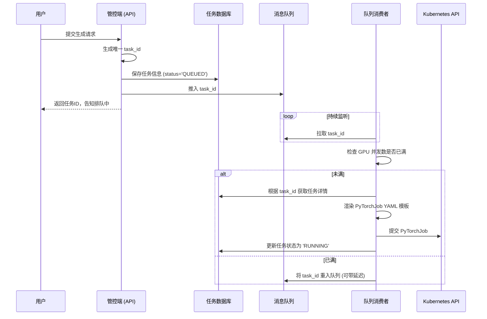
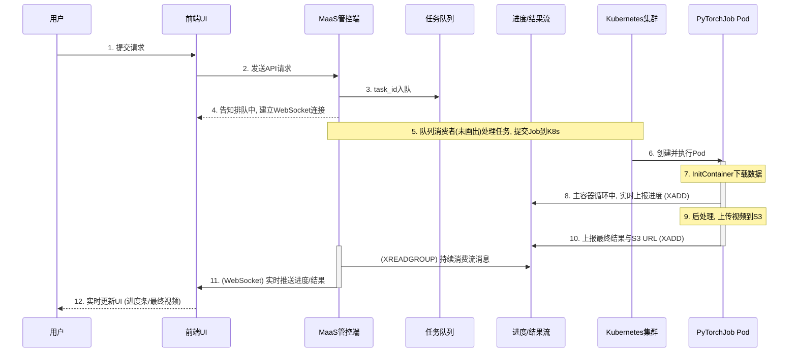

## 1. 架构分层

我们可以将整个后端系统划分为三个逻辑层面：

### 1.1. 接入与控制层

这一层即“**MaaS 管控端**”。它的职责是接收前端请求，并将其转化为可执行的后端任务。

#### 1.1.1. 任务参数化与模板化

管控端的核心功能之一是作为 `PyTorchJob` 的“工厂”。它内置一个或多个基础的 YAML 文件作为**任务模板**。这些模板包含了 Pod 规格、卷挂载等通用配置。

**模板占位符示例**:

```yaml
apiVersion: "kubeflow.org/v1"
kind: PyTorchJob
metadata:
  name: wan22-job-{{ task_id }} # <-- 任务唯一ID
spec:
  # ...
  initContainers:
  - name: download-image
    command:
      - "cp"
      - "s3://{{ s3_bucket }}/{{ user_image_key }}" # <-- 用户上传的图片S3路径
      - "/image-data/input.jpg"
  # ...
  containers:
  - name: pytorch
    args:
      - "--prompt"
      - "{{ prompt_text }}" # <-- 用户的文本提示
      - "--size"
      - "{{ resolution }}" # <-- 用户选择的分辨率
```

当队列消费者处理一个任务时，它会使用模板引擎，将从数据库中查到的任务详情精确地渲染到这些占位符中，生成一份最终可执行的 YAML。

#### 1.1.2. 任务队列与并发控制

直接将用户请求转化为 `PyTorchJob` 并提交到 Kubernetes 是非常危险的，因为集群的 GPU 资源有限。如果瞬间涌入大量请求，会导致大量 Pod 处于 `Pending` 状态，甚至可能冲击 K8s 的调度系统。因此，引入**任务队列**进行削峰填谷和并发控制是非常有必要的。

**核心目的**:

- **资源保护**: 确保同时在运行的 GPU 任务数不超过集群实际承载能力，避免资源超售和雪崩。
- **流量削峰**: 优雅地处理突发的用户请求，将其“拉平”为平稳的消费速率。
- **任务管理**: 支持任务的精细化管理，如任务队列、任务优先级等。

**工作流程**:

该模块由一个**任务数据库（DB）**、一个**消息队列（MQ）**和一个**队列消费者（Worker）**组成。

1.  **接收请求**: 管控端的 API 服务接收到用户请求。
2.  **持久化任务**: 服务立即生成一个唯一的 `task_id`，并将任务的所有信息（如 prompt、用户ID、所选参数、状态=`QUEUED`）存入数据库（如 Redis, PostgreSQL）。
3.  **入队**: 将 `task_id` 推入消息队列（如 Redis Stream）。
4.  **消费任务**: 一个或多个独立的“队列消费者”进程持续监听消息队列。
5.  **并发控制**: 当消费者从队列中取出一个 `task_id` 后，它**必须先检查当前集群中正在运行的任务数是否已达到上限**。这可以通过查询 K8s API 或维护一个全局计数器来实现。
6.  **执行分发**: 如果有空闲的 GPU 名额，消费者才会执行下一步的“任务模板化与提交”；如果没有，它会将 `task_id` 重新放回队列（或等待一段时间后重试）。

下面是一个简化的流程时序图：



### 1.2. 任务调度与执行层

这一层由 PyTorchJob 核心组件构成，负责将“指令”变为“行动”。

- **资源创建**: `PyTorchJob` Controller 监听到新的 `PyTorchJob` 资源被创建后，会根据 `pytorchReplicaSpecs` 的定义，创建对应的 `Master` 和 `Worker` Pods。
- **Pod 调度**: Kubernetes Scheduler 根据 Pod 的资源请求（CPU, memory, GPU）以及**反亲和性规则（`podAntiAffinity`）**，将 `Master` 和 `Worker` Pod 分散地调度到不同的物理节点上，以最大化性能。
- **资源分配**: HAMI vGPU 调度器介入 GPU 的分配过程，为请求 `nvidia.com/gpu: "2"` 的 Pod 分配相应的虚拟 GPU 资源。
- **任务执行**: Pod 启动后，按照 `command` 和 `args` 的定义，开始执行任务（例如，运行 `run.sh` 脚本）。

### 1.3. 数据与存储层

这一层负责管理整个工作流中数据的流转和生命周期。

- **模型加载**: Pod 启动时，通过 `hostPath` 卷直接从节点本地磁盘加载预先下载好的大模型文件。
- **动态输入**: `initContainer` 作为 Pod 的第一个步骤，从 S3 下载用户上传的图片等动态输入，并存入一个 Pod 内共享的 `emptyDir` 卷中。
- **中间产物**: 视频生成过程中的临时数据存储在内存中或本地磁盘上。
- **最终输出**: `generate.py` 将生成的原始视频保存在本地。`postprocess.py` 读取该文件，处理后（如添加水印），最终上传到 S3 的指定存储桶中。

## 2. 一次完整的视频生成过程

下面是结合了任务队列、并发控制和实时消息通知的完整端到端工作流的可视化时序图：



一次典型的用户请求会经历以下过程：

1.  **用户提交**: 用户在前端界面输入 prompt，上传图片，点击“生成”。
2.  **请求入队**: MaaS 管控端的 API 服务接收到请求。它立即生成一个唯一的 `task_id`，将任务的所有信息（prompt、参数、用户ID等）存入**任务数据库**并标记状态为 `QUEUED`，然后将 `task_id` 推入**任务消息队列**（如 RabbitMQ 或 Redis List）。管控端立即向前端返回 `task_id`，告知用户“任务已开始排队”。
3.  **建立实时通道**: 前端在收到排队通知后，与管控端建立一个 **WebSocket** 长连接，用于后续接收实时通知。
4.  **任务消费与分发**: 一个后台的**队列消费者**进程从任务队列中获取 `task_id`。在确认当前有可用的 GPU 资源后，它从数据库中检索任务详情，使用模板渲染 `PyTorchJob` YAML，并将其提交到 Kubernetes 集群。同时，更新数据库中该任务的状态为 `RUNNING`。
5.  **Pod 调度与执行**: Kubeflow 和 K8s 在不同的节点上创建 `Master` 和 `Worker` Pods。
6.  **数据注入**: Pod 的 `initContainer` 运行，从 S3 下载用户上传的图片到 Pod 内的共享卷。
7.  **工作流启动**: 主容器启动，执行 `run.sh` 脚本。
8.  **实时进度上报**: `run.sh` 调用 `generate.py`。在生成循环中，`generate.py` 将带有 `task_id` 和进度的消息通过 `XADD` 命令实时发送到 **Redis Stream**。
9.  **结果后处理**: `generate.py` 完成后，`run.sh` 调用 `postprocess.py`，后者执行水印等操作，并将最终视频上传到 S3。
10.  **完成通知**: `postprocess.py` 在上传成功后，向一个**完成消息队列**（或同一个 Redis Stream）发送一条包含 `task_id` 和最终 S3 URL 的“完成”消息。
11.  MaaS 管控端：
     -   通过 **WebSocket** 与前端保持长连接。
     -   订阅 Redis Stream 中的**进度主题**和**完成主题**。
     -   当收到进度消息时，立即通过 WebSocket 将其转发给对应的用户前端。
     -   当收到完成消息时，将最终 URL 通过 WebSocket 推送给用户，并更新数据库中的任务状态为 `COMPLETED`。
12.  **前端UI**: 前端根据通过 WebSocket 收到的实时消息，更新进度条，并在收到完成消息后，显示最终的视频。

