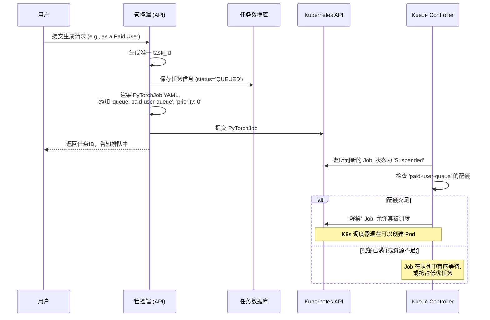
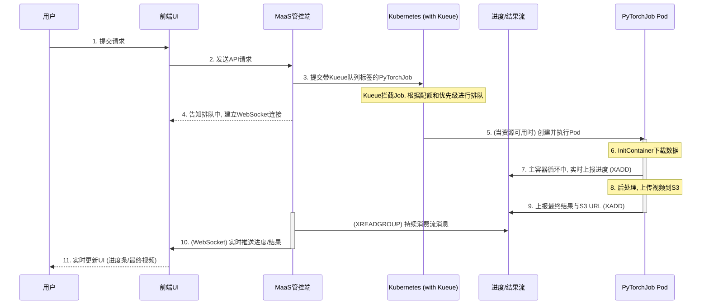

## 1. 架构分层

我们可以将整个后端系统划分为三个逻辑层面：

### 1.1. 接入与控制层

这一层即“**MaaS 管控端**”。它的职责是接收前端请求，并将其转化为可执行的、可被调度的后端任务。

#### 1.1.1. 任务参数化与模板化

管控端的核心功能之一是作为 `PyTorchJob` 的“工厂”。它内置一个或多个基础的 YAML 文件作为**任务模板**。这些模板包含了 Pod 规格、卷挂载等通用配置。

当接收到请求时，管控端会根据用户身份（如付费用户、免费用户）和请求参数，动态渲染模板，生成最终的 `PyTorchJob` YAML。

**模板占位符与动态渲染示例**:

```yaml
apiVersion: "kubeflow.org/v1"
kind: PyTorchJob
metadata:
  name: wan22-job-{{ task_id }} # <-- 任务唯一ID
  labels:
    kueue.x-k8s.io/queue-name: "{{ queue_name }}" # <-- 动态渲染：paid-user-queue 或 free-user-queue
spec:
  priority: {{ priority }} # <-- 动态渲染：高优先级为 0, 普通为 100
  # ...
  containers:
  - name: pytorch
    args:
      - "--prompt"
      - "{{ prompt_text }}" # <-- 用户的文本提示
      - "--size"
      - "{{ resolution }}" # <-- 用户选择的分辨率
```

#### 1.1.2. 基于 Kueue 的原生任务队列与 QoS 保障

为了有效管理昂贵的 GPU 资源，避免因请求突发导致集群超载，我们引入 **Kueue**，一个 Kubernetes 原生的作业排队系统，来实现削峰填谷、并发控制和差异化服务质量（QoS）。

与自研应用层队列不同，Kueue 将排队和调度能力直接集成到 Kubernetes 基础设施中，使我们能以声明式的方式管理任务。

**核心组件与概念**:

-   **ClusterQueue**: 集群级别的队列。我们定义两个核心队列：`paid-user-queue` 和 `free-user-queue`。每个队列都可以配置独立的资源配额、抢占策略等。
-   **LocalQueue**: `ClusterQueue` 在具体命名空间中的代理。
-   **ResourceFlavor**: 对物理资源的抽象，例如，我们可以定义一个名为 `a100` 的 flavor 来特指 A100 GPU。

**通过 Kueue 实现差异化 QoS**:

1.  **配额隔离**：为付费用户队列分配更多的 GPU 资源。例如，在总共 10 个 GPU 的集群中，我们可以为 `paid-user-queue` 分配 8 个 GPU 的并发额度，而为 `free-user-queue` 只分配 2 个。

    ```yaml
    # 付费用户队列，拥有 8 个 GPU 的配额
    apiVersion: kueue.x-k8s.io/v1beta1
    kind: ClusterQueue
    metadata:
      name: "paid-user-queue"
    spec:
      resourceGroups:
      - coveredResources: ["nvidia.com/gpu"]
        flavors:
        - name: "default-flavor"
          resources:
          - name: "nvidia.com/gpu"
            nominalQuota: 8
    ---
    # 免费用户队列，拥有 2 个 GPU 的配额
    apiVersion: kueue.x-k8s.io/v1beta1
    kind: ClusterQueue
    metadata:
      name: "free-user-queue"
    spec:
      resourceGroups:
      - coveredResources: ["nvidia.com/gpu"]
        flavors:
        - name: "default-flavor"
          resources:
          - name: "nvidia.com/gpu"
            nominalQuota: 2
    ```

2.  **抢占与优先级**：我们可以配置 `paid-user-queue` 具有抢占能力。当付费用户的任务提交时，如果集群资源已满，Kueue 可以自动“挂起”一个正在运行的、较低优先级的免费任务，以释放资源供付费任务使用。这通过 `priority` 字段和 `preemption` 策略来实现。

**新的工作流程**:

原有的“消息队列+消费者”模式被彻底取代，流程极大简化：

1.  **接收请求**: 管控端的 API 服务接收到用户请求。
2.  **身份识别与持久化**: 服务识别用户身份（付费/免费），生成 `task_id`，并将任务信息存入数据库，状态为 `QUEUED`。
3.  **渲染并提交**: 管控端根据用户身份，选择对应的队列名称（`paid-user-queue` 或 `free-user-queue`）和优先级，渲染 `PyTorchJob` YAML 模板，然后**直接将其提交到 Kubernetes API**。
4.  **Kueue 调度**: Kueue 控制器自动拦截这个新提交的 Job，使其处于 `Suspended` (暂停) 状态。Kueue 会根据对应 `ClusterQueue` 的配额和优先级规则，决定何时“解禁”该 Job，允许它被调度和执行。
5.  **返回响应**: API 服务在提交 Job 后，立即向用户返回 `task_id`，告知任务正在排队。

下面是采用 Kueue 后的架构流程图：



### 1.2. 任务调度与执行层

这一层由 Kueue 和 PyTorchJob 控制器共同构成。

-   **排队与准入**: Kueue 作为准入控制器，决定一个 `PyTorchJob` 是否可以开始执行。
-   **资源创建**: 一旦 Kueue“解禁”一个 `PyTorchJob`，PyTorchJob Controller 就会像原来一样创建对应的 `Master` 和 `Worker` Pods。
-   **Pod 调度与资源分配**: 后续流程不变。Kubernetes Scheduler 和 HAMI vGPU 调度器负责将 Pod 放置到具体节点并分配 vGPU 资源。
-   **任务执行**: Pod 启动后，执行任务脚本。

### 1.3. 数据与存储层

这一层不受影响，工作方式与之前完全相同。

## 2. 一次完整的视频生成过程

下面是集成了 Kueue 的、新的端到端工作流：



采用 Kueue 后的用户请求流程：

1.  **用户提交**: 用户在前端界面输入 prompt，上传图片，点击“生成”。
2.  **请求处理与提交**: MaaS 管控端的 API 服务接收到请求。它识别用户身份（如付费用户），生成 `task_id`，将任务信息存入**任务数据库**。然后，它使用模板渲染 `PyTorchJob` YAML，**在其中嵌入正确的队列名称（如 `paid-user-queue`）和优先级**，并直接将这份 YAML **提交到 Kubernetes API**。管控端立即向前端返回 `task_id`。
3.  **建立实时通道**: 前端与管控端建立 **WebSocket** 连接，用于接收实时通知。
4.  **Kueue 调度**: Kueue 监听到这个新 Job，并根据 `paid-user-queue` 的配额和当前资源使用情况进行判断。如果队列有空闲资源，Job 就被允许执行；否则，它会在 Kueue 中安全地排队等待，或根据抢占规则为它腾出资源。
5.  **Pod 调度与执行**: 一旦 Kueue 准许，Kubernetes 就会创建 `PyTorchJob` 的 Pods。
6.  **数据注入**: Pod 的 `initContainer` 从 S3 下载用户数据。
7.  **工作流启动与进度上报**: 主容器启动，执行任务，并通过 **Redis Stream** 实时汇报进度。
8.  **结果后处理与通知**: 任务完成后，将视频上传到 S3，并通过 Redis Stream 发送“完成”消息。
9.  **结果推送**: 管控端监听到 Redis Stream 的消息，通过 WebSocket 将进度和最终结果实时推送给前端。
10. **前端 UI**: 前端实时更新界面，最终向用户展示生成的视频。