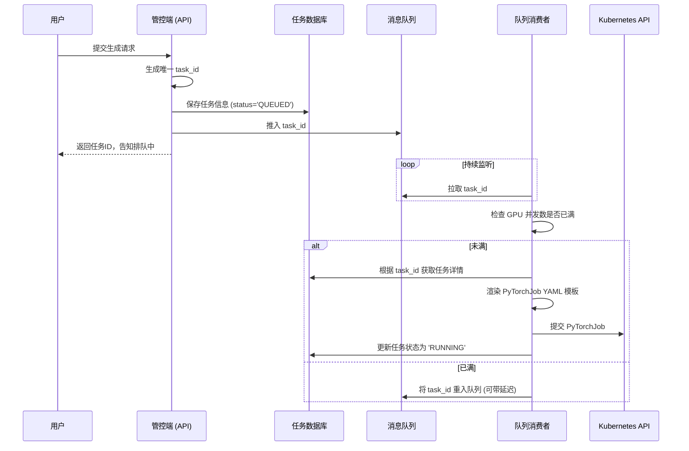
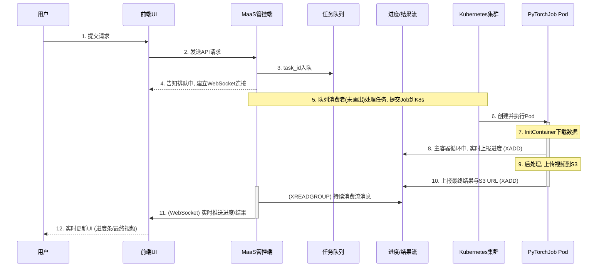

# 体验中心后端架构深度解析 (最终版)

## 1. 引言

本文档旨在对当前“视频生成体验中心”的后端服务架构进行一次全面的、深度的梳理与解析。通过分析现有的技术组件、工作流程和设计模式，我们将描绘出系统从接收用户请求到交付最终视频的完整生命周期。

该架构的核心目标是构建一个以 Kubernetes 为基础、具备伸缩性和可维护性的 **模型即服务（Model-as-a-Service, MaaS）** 平台，专门用于处理资源密集型的 AI 视频生成任务。

## 2. 核心组件与技术栈

系统由一系列云原生技术和开源组件构成，形成了一个分层、解耦的架构。

- **容器编排 (Orchestration)**: **Kubernetes**
  - 作为整个系统的底座，负责资源的调度、部署和管理。
- **AI 任务调度 (ML Workload)**: **Kubeflow PyTorchJob**
  - 使用 `PyTorchJob` CRD 来声明式地定义和管理分布式视频生成任务，优雅地处理了 `Master` 和 `Worker` 的生命周期。
- **计算环境 (Compute)**: **Docker** & **NVIDIA GPU**
  - 所有任务都运行在 Docker 容器中，并利用 NVIDIA GPU 进行硬件加速。
- **GPU 虚拟化 (GPU Virtualization)**: **HAMI vGPU**
  - 通过 HAMI vGPU 方案实现了 GPU 资源的共享和虚拟化，提高了物理 GPU 的利用率，但也引入了一定的复杂性。
- **应用逻辑 (Application Logic)**: **Python** & **torchrun**
  - 核心生成逻辑由 Python 脚本（`generate.py`）承载，并通过 `torchrun` 来启动分布式推理。
- **数据存储 (Storage)**:
  - **对象存储 (S3)**: 用于存储用户的动态输入（如图片）和最终生成的视频输出，具有高可用和可扩展性。
  - **本地存储 (hostPath)**: 用于存放核心的模型文件，目前通过 `hostPath` 挂载，简化了初始部署。
- **配置与密钥 (Configuration & Secrets)**: **Kubernetes Secrets**
  - S3 访问凭证等敏感信息通过 K8s Secret 进行管理，并以环境变量的形式注入到 Pod 中，实现了配置与代码的分离。
- **工作流编排 (Workflow Orchestration)**: **Shell 脚本 (`run.sh`)**
  - 采用轻量级的 Shell 脚本来编排“生成”和“后处理”两个步骤，实现了逻辑的初步解耦。

## 3. 架构分层解析

我们可以将整个后端系统划分为三个逻辑层面：

### 3.1. 接入与控制层 (Access & Control Plane)

这一层是整个体验中心的大脑，即“**MaaS 管控端**”。它的职责是接收前端请求，并将其转化为可执行的后端任务。

#### 3.1.1. 任务参数化与模板化 (Task Parameterization & Templating)

管控端的核心功能之一是作为 `PyTorchJob` 的“工厂”。它内置一个或多个基础的 YAML 文件作为**任务模板**。这些模板包含了 Pod 规格、卷挂载、反亲和性规则等通用配置，但在需要动态变化的地方使用了占位符。

**模板占位符示例**:
```yaml
apiVersion: "kubeflow.org/v1"
kind: PyTorchJob
metadata:
  name: wan22-job-{{ task_id }} # <-- 任务唯一ID
spec:
  # ...
  initContainers:
  - name: download-image
    command:
      - "cp"
      - "s3://{{ s3_bucket }}/{{ user_image_key }}" # <-- 用户上传的图片S3路径
      - "/image-data/input.jpg"
  # ...
  containers:
  - name: pytorch
    args:
      - "--prompt"
      - "{{ prompt_text }}" # <-- 用户的文本提示
      - "--size"
      - "{{ resolution }}" # <-- 用户选择的分辨率
```
当队列消费者处理一个任务时，它会使用 **Jinja2** 等模板引擎，将从数据库中查到的任务详情精确地渲染到这些占位符中，生成一份最终可执行的 YAML。

#### 3.1.2. 任务队列与并发控制 (Task Queue & Concurrency Control)

直接将用户请求转化为 `PyTorchJob` 并提交到 Kubernetes 是非常危险的，因为集群的 GPU 资源有限。如果瞬间涌入大量请求，会导致大量 Pod 处于 `Pending` 状态，甚至可能冲击 K8s 的调度系统。因此，引入**任务队列**进行削峰填谷和并发控制是架构设计的关键。

**核心目的**:
- **资源保护**: 确保同时在运行的 GPU 任务数不超过集群实际承载能力，避免资源超售和雪崩。
- **流量削峰**: 优雅地处理突发的用户请求，将其“拉平”为平稳的消费速率。
- **任务持久化**: 即使用户关闭了网页，其提交的任务请求也不会丢失。

**工作流程**:

该模块由一个**任务数据库（DB）**、一个**消息队列（MQ）**和一个**队列消费者（Worker）**组成。

1.  **接收请求**: 管控端的 API 服务接收到用户请求。
2.  **持久化任务**: 服务立即生成一个唯一的 `task_id`，并将任务的所有信息（如 prompt、用户ID、所选参数、状态=`QUEUED`）存入数据库（如 Redis, PostgreSQL）。
3.  **入队**: 将 `task_id` 推入消息队列（如 RabbitMQ, Redis List）。
4.  **消费任务**: 一个或多个独立的“队列消费者”进程持续监听消息队列。
5.  **并发控制**: 当消费者从队列中取出一个 `task_id` 后，它**必须先检查当前集群中正在运行的任务数是否已达到上限**。这可以通过查询 K8s API 或维护一个全局计数器来实现。
6.  **执行分发**: 如果有空闲的 GPU 名额，消费者才会执行下一步的“任务模板化与提交”；如果没有，它会将 `task_id` 重新放回队列（或等待一段时间后重试）。

下面是一个简化的流程时序图：



### 3.2. 任务调度与执行层 (Job Scheduling & Execution Plane)

这一层由 Kubernetes 和 Kubeflow 核心组件构成，负责将“指令”变为“行动”。

- **资源创建**: `PyTorchJob` Controller 监听到新的 `PyTorchJob` 资源被创建后，会根据 `pytorchReplicaSpecs` 的定义，创建对应的 `Master` 和 `Worker` Pods。
- **Pod 调度**: Kubernetes Scheduler 根据 Pod 的资源请求（CPU, memory, GPU）以及**反亲和性规则（`podAntiAffinity`）**，将 `Master` 和 `Worker` Pod 分散地调度到不同的物理节点上，以最大化性能。
- **资源分配**: HAMI vGPU 调度器介入 GPU 的分配过程，为请求 `nvidia.com/gpu: "2"` 的 Pod 分配相应的虚拟 GPU 资源。
- **任务执行**: Pod 启动后，按照 `command` 和 `args` 的定义，开始执行任务（例如，运行 `run.sh` 脚本）。

### 3.3. 数据与存储层 (Data & Storage Plane)

这一层负责管理整个工作流中数据的流转和生命周期。

- **模型加载**: Pod 启动时，通过 `hostPath` 卷直接从节点本地磁盘加载预先下载好的大模型文件。
- **动态输入**: `initContainer` 作为 Pod 的第一个步骤，从 S3 下载用户上传的图片等动态输入，并存入一个 Pod 内共享的 `emptyDir` 卷中。
- **中间产物**: 视频生成过程中的临时数据存储在内存中或本地磁盘上。
- **最终输出**: `generate.py` 将生成的原始视频保存在本地。`postprocess.py` 读取该文件，处理后（如添加水印），最终上传到 S3 的指定存储桶中。

## 4. 工作流详解：一次完整的视频生成过程

下面是结合了任务队列、并发控制和实时消息通知的完整端到端工作流的可视化时序图：



将以上所有组件串联起来，一次典型的用户请求会经历以下旅程：

1.  **用户提交 (User Submission)**: 用户在前端界面输入 prompt，上传图片，点击“生成”。
2.  **请求入队 (Request Queuing)**: MaaS 管控端的 API 服务接收到请求。它立即生成一个唯一的 `task_id`，将任务的所有信息（prompt、参数、用户ID等）存入**任务数据库**并标记状态为 `QUEUED`，然后将 `task_id` 推入**任务消息队列**（如 RabbitMQ 或 Redis List）。管控端立即向前端返回 `task_id`，告知用户“任务已开始排队”。
3.  **建立实时通道 (Real-time Channel)**: 前端在收到排队通知后，与管控端建立一个 **WebSocket** 长连接，用于后续接收实时通知。
4.  **任务消费与分发 (Job Consumption & Dispatch)**: 一个后台的**队列消费者**进程从任务队列中获取 `task_id`。在确认当前有可用的 GPU 资源后，它从数据库中检索任务详情，使用 Jinja2 模板渲染 `PyTorchJob` YAML，并将其提交到 Kubernetes 集群。同时，更新数据库中该任务的状态为 `RUNNING`。
5.  **Pod 调度与执行 (Pod Scheduling & Execution)**: Kubeflow 和 K8s 在不同的节点上创建 `Master` 和 `Worker` Pods。
6.  **数据注入 (Data Injection)**: Pod 的 `initContainer` 运行，从 S3 下载用户上传的图片到 Pod 内的共享卷。
7.  **工作流启动 (Workflow Start)**: 主容器启动，执行 `run.sh` 脚本。
8.  **实时进度上报 (Real-time Progress Reporting)**: `run.sh` 调用 `generate.py`。在生成循环中，`generate.py` 将带有 `task_id` 和进度的消息通过 `XADD` 命令实时发送到 **Redis Stream**（进度主题）。
9.  **结果后处理 (Post-processing)**: `generate.py` 完成后，`run.sh` 调用 `postprocess.py`，后者执行水印等操作，并将最终视频上传到 S3。
10. **完成通知 (Completion Notification)**: `postprocess.py` 在上传成功后，向一个**完成消息队列**（或同一个 Redis Stream）发送一条包含 `task_id` 和最终 S3 URL 的“完成”消息。
11. **实时中继与推送 (Real-time Relay & Push)**: MaaS 管控端有另一个服务，它：
    -   通过 **WebSocket** 与前端保持长连接。
    -   订阅 Redis Stream 中的**进度主题**和**完成主题**。
    -   当收到进度消息时，立即通过 WebSocket 将其转发给对应的用户前端。
    -   当收到完成消息时，将最终 URL 通过 WebSocket 推送给用户，并更新数据库中的任务状态为 `COMPLETED`。
12. **前端呈现 (Frontend Display)**: 前端根据通过 WebSocket 收到的实时消息，更新进度条，并在收到完成消息后，显示最终的视频。

## 5. 架构的优势与待改进点

### 5.1. 优势 (Strengths)

- **云原生基础**: 基于 Kubernetes 和 Docker，具备良好的伸缩性、弹性和可移植性。
- **声明式部署**: 通过 `PyTorchJob` CRD，以声明式的方式管理复杂的分布式任务，降低了运维心智负担。
- **逻辑解耦**: 通过引入 `postprocess.py` 和 `run.sh`，成功将核心生成逻辑与后处理逻辑分离，提高了代码的可维护性和扩展性。
- **安全的密钥管理**: 利用 Kubernetes Secret 来管理 S3 凭证，避免了硬编码风险。

### 5.2. 待改进点与架构专题

- **模型存储方式**: 当前使用 `hostPath` 来挂载模型，这意味着模型必须预先存在于所有可能的计算节点上。这**降低了集群的弹性和可扩展性**。
  - **改进建议**:
    1.  **共享只读卷**: 将模型存放在一个共享存储（如 NFS, CephFS）中，并通过 `ReadOnlyMany` 类型的 PVC 挂载给所有 Pod。
    2.  **打包进镜像**: 对于体积不是特别巨大的模型，直接将其打包进 Docker 镜像中是更云原生的做法，实现了“一个镜像，随处运行”。

- **GPU 虚拟化带来的复杂性**: HAMI vGPU 虽然提高了资源利用率，但也引入了额外的配置和调试复杂性（如我们之前遇到的 NCCL 死锁问题）。需要有成熟的运维经验来驾驭。

- **工作流编排**: `run.sh` 适用于简单的线性流程。如果未来后处理步骤变得更复杂（例如，生成->超分->水印->转码），可以考虑引入更专业的**工作流引擎**，如 **Argo Workflows** 或 **Tekton**，它们能以声明式的方式定义和执行复杂的多步骤 DAG（有向无环图）工作流。

### 架构专题：任务结果与进度通知机制的深度评估

一个优秀的MaaS平台需要一个可靠、实时的事件驱动机制来反馈任务状态。特别是当引入“实时进度条”这类需求后，对架构的选择就至关重要。

#### 模式A：客户端轮询 (Client-Side Polling)
- **工作原理**: 前端定时向后端查询任务状态。后端为了提供进度，需要去查询一个由`generate.py`不断更新的共享状态存储（如Redis）。
- **评估**: 这是一个“用轮询模拟实时”的笨拙方法。为了平滑的进度条，需要极高频率的轮询，会给后端API带来巨大且不必要的压力。**不推荐用于实时进度反馈**。

#### 模式B：Kubernetes原生事件驱动 (Kubernetes-Native Eventing)
- **工作原理**: `generate.py`在循环中不断`patch` `PyTorchJob`资源的`annotations`来更新进度。
- **评估**: 这是对K8s API的一种“滥用”。API Server为配置管理而设计，不适合作为高频消息总线。大量任务并发时，频繁的`patch`操作会严重冲击API Server，影响整个集群的稳定性。此方案适用于“完成”等**低频事件**，但**不适用于“进度”这类高频事件流**。

#### 模式C：外部消息队列 + WebSocket (External Message Queue) - [推荐方案]
- **工作原理**: 
  1. **Pod作为生产者**: `generate.py`在生成循环中，将进度消息（如`{"task_id": "xyz", "progress": 25}`）发布到消息队列（如RabbitMQ, Redis Pub/Sub）的特定主题。
  2. **管控端作为中继**: 管控端订阅该主题，接收实时的进度消息流。
  3. **实时推送到前端**: 管控端通过与浏览器建立的 **WebSocket** 长连接，将收到的进度消息实时转发给对应的用户。
- **评估**: 这是为“服务端实时推送”场景而生的**标准解决方案**。消息队列能以极低延迟处理海量消息，WebSocket则提供了高效的全双工通信渠道，能完美实现平滑的进度条和即时的结果通知。

#### 方案对比总结

| 特性 | 模式A：客户端轮询 | 模式B：K8s原生事件 | 模式C：外部消息队列 | 
| :--- | :--- | :--- | :--- |
| **实时性** | 低 | 中 | **最高** |
| **架构复杂度** | 低 | 中 | **高** |
| **后端开销** | 高 (大量HTTP轮询) | **极高** (滥用K8s API) | 低 (专业组件) |
| **可靠性** | 中 (依赖客户端) | 低 (可能影响集群) | **最高** (有重试/持久化) |
| **实时进度更新** | 差 (Poor) | **反模式 (Anti-Pattern)** | **优秀 (Excellent)** |

#### 最终建议

**引入“实时进度”需求后，模式C（外部消息队列 + WebSocket）从“长期规划”升级为“当前阶段的最佳架构选择”。**

虽然它带来了更高的架构复杂度（需要引入并维护消息队列和WebSocket服务），但这是提供流畅、专业、可扩展的实时用户体验所必需的技术投资。

----

----

