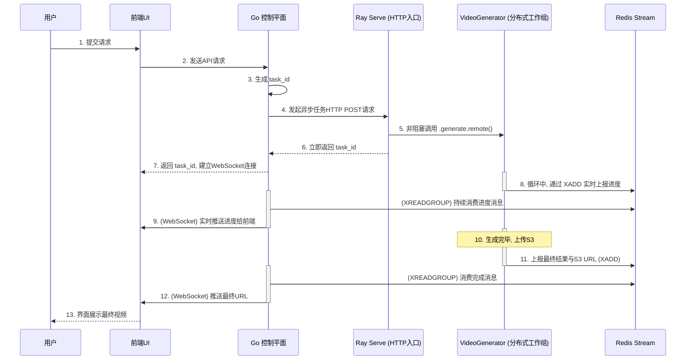

# 基于 Ray Serve 的分布式推理服务架构详解

## 1. 引言与目标

本文档是 **《多机多卡分布式推理架构选型》** 的续篇与最终决策方案。

根据之前的选型结论，我们选择采用 **Ray Serve** 框架，将 `wan2.2` 视频生成能力从一次性的批处理作业，改造为一个高性能、高可用、可伸缩且兼具成本效益的在线服务。本文档将详细阐述采用 Ray Serve 后的最终系统架构、核心组件职责、代码重构方案以及端到端的工作流程。

**最终目标**：构建一个以 Ray on Kubernetes 为计算核心、Go 为控制平面的现代化 AI 服务，为用户提供流畅、可交互的视频生成体验。

## 2. 新版架构核心组件

改造后的架构由以下几个核心部分组成：

1.  **Go 控制平面 (Go Control Plane)**
    -   **角色**: 系统的总入口和用户交互中心。
    -   **职责**: 
        -   提供面向前端的 REST API 和用于实时通知的 WebSocket 服务。
        -   处理用户认证、请求校验和管理。
        -   作为“任务提交者”，向 Ray Serve 的 HTTP 端点发起**异步任务**请求。
        -   作为“消息消费者”，订阅 Redis Stream，接收来自 Ray 工作进程的实时进度和最终结果，并通过 WebSocket 推送给前端。

2.  **Ray on Kubernetes 集群 (Ray on K8s Cluster)**
    -   **角色**: 系统的核心计算引擎，取代了原有的 `PyTorchJob` 模式。
    -   **组成**: 通过 Ray Operator 部署，包含两类 Pod：
        -   **Ray Head Pod**: Ray 集群的大脑，负责协调和管理所有 Worker 节点和 Actor。
        -   **Ray Worker Pods**: 实际执行计算任务的 Pod 池，每个 Pod 都配备 GPU 资源。该池可以通过 Ray Operator 实现基于集群负载的自动伸缩。

3.  **Ray Serve 应用 (Python Application)**
    -   **角色**: 运行在 Ray 集群之上的、我们自己编写的 Python 服务化应用。
    -   **组成**: 主要包含两个逻辑部署（`@serve.deployment`）：
        -   **`APIEntrypoint` (API 入口)**: 一个轻量级的服务，负责暴露一个 HTTP 端点。它的唯一职责是接收来自 Go 控制平面的请求，启动一个后台的分布式生成任务，然后**立即返回一个任务ID**。
        -   **`VideoGenerator` (分布式工作组)**: 由 N 个 Ray Actor 组成的工作组（N = 分布式推理所需的总进程数）。这是真正执行计算的单元。所有 Actor 在启动时会**自动组建成一个 `torch.distributed` 进程组**，并加载 `wan2.2` 模型到显存中常驻，随时准备处理任务。

4.  **Redis (消息总线)**
    -   **角色**: 在新架构中，其职责更加聚焦和清晰：作为**单向的、从计算层到控制层的状态通知总线**。
    -   **职责**: 接收并持久化 `VideoGenerator` Actor 在工作时实时上报的进度和最终结果消息（使用 Redis Stream 数据类型）。

## 3. 代码结构重构指南

为了适配 Ray Serve 的编程模型，我们需要对现有的 Python 代码进行重构，核心思想是“**从脚本化到模块化**”。

1.  **`generate.py` -> `core_logic.py`**
    -   将 `generate.py` 中核心的、与模型和算法相关的生成逻辑，剥离并重构到一个或多个可被导入的函数中，例如 `run_distributed_generation(...)`。
    -   这个函数将不再自己解析命令行参数，而是通过函数参数接收所有必要的配置，如 `prompt`, `sampling_steps` 等。

2.  **创建 `serve_app.py` (新的应用入口)**
    -   这将是我们的主入口文件，用于定义和启动 Ray Serve 应用。
    -   其中将包含我们架构中的两个核心类：

    ```python
    # serve_app.py (概念代码)
    import ray
    from ray import serve
    from typing import Dict
    
    # 从重构后的模块中导入核心逻辑
    # from core_logic import run_distributed_generation
    
    @serve.deployment(
        num_replicas=8,  # <-- 分布式推理所需的总进程数
        ray_actor_options={"num_gpus": 1} # 每个副本/Actor需要1个GPU
    )
    class VideoGenerator:
        def __init__(self):
            # Actor 初始化时，所有副本会在此处自动组建 torch.distributed 进程组
            # 并加载模型到各自的 GPU 中
            # setup_torch_distributed_and_load_model()
            print(f"模型已在 Rank {ray.get_rank()} 上加载完毕")
    
        def generate(self, task_id: str, prompt: str, redis_config: Dict) -> None:
            """执行一次完整的生成、进度上报和结果上传"""
            # 在这里调用重构后的核心生成逻辑
            # run_distributed_generation(task_id, prompt, redis_config, ...)
            print(f"Rank {ray.get_rank()} 正在为任务 {task_id} 工作...")
            # ... 循环中通过 XADD 上报进度到 Redis ...
            # ... 上传视频到 S3 ...
            # ... 上报最终结果到 Redis ...
            return
    
    @serve.deployment
    class APIEntrypoint:
        def __init__(self, generator_handle):
            self.generator_handle = generator_handle
    
        async def generate(self, http_request):
            """处理来自 Go 控制平面的 HTTP 请求"""
            json_data = await http_request.json()
            task_id = json_data.get("task_id")
            prompt = json_data.get("prompt")
    
            # 关键：异步、非阻塞地调用后台分布式工作组
            # .remote() 方法会立即返回，不会等待 generate 方法执行完毕
            self.generator_handle.generate.remote(task_id, prompt, ...)
    
            # 立即返回，告知任务已启动
            return {"status": "task_started", "task_id": task_id}
    
    # 将两个部署绑定在一起，构建应用
    entrypoint = APIEntrypoint.bind(VideoGenerator.bind())
    ```

## 4. 端到端工作流详解

采用新架构后，一次完整的用户请求将经历以下流程：



## 5. 新架构的优势总结

-   **简化了分布式逻辑**: 您不再需要手动管理 `StatefulSet`、`Headless Service`、`MASTER_ADDR` 环境变量或 `torchrun`。Ray 以更 Pythonic 的方式为您处理了所有复杂的分布式组网和进程管理。
-   **统一的编程模型**: 无论是 API 入口还是底层的分布式计算，都可以在一套 Python 代码和 Ray 的编程模型下完成，降低了开发和维护的心智负担。
-   **内置可扩展性与容错**: Ray 天生为可扩展性设计。Ray Serve 部署可以轻松增减副本数。Ray Actor 也具备自动重启等容错能力，提升了服务的健壮性。
-   **保留了核心算法**: 改造的核心在于“封装”而非“重写”。您在 `torch.distributed`、FSDP 等方面的核心算法逻辑可以最大程度地保留，只需将其放入 Ray Actor 的方法中即可。
-   **实现了成本效益**: 结合 Ray Operator 的集群自动伸缩能力，可以在没有任务时将 Ray Worker Pod 缩容到 0，实现了与 KEDA 方案类似的“按需付费”效果。
