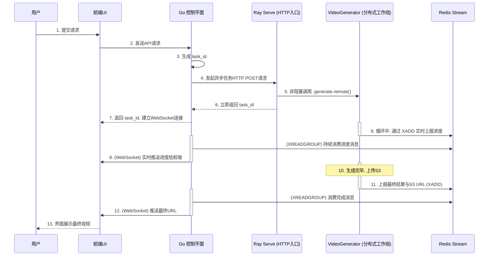
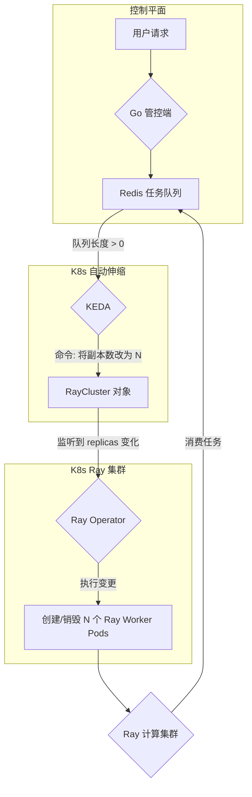

# 基于 Ray Serve 的分布式推理服务架构详解

## 1. 引言与目标

本文档是 **《多机多卡分布式推理架构选型》** 的续篇与最终决策方案。

根据之前的选型结论，我们选择采用 **Ray Serve** 框架，将 `wan2.2` 视频生成能力从一次性的批处理作业，改造为一个高性能、高可用、可伸缩且兼具成本效益的在线服务。本文档将详细阐述采用 Ray Serve 后的最终系统架构、核心组件职责、代码重构方案以及端到端的工作流程。

**最终目标**：构建一个以 Ray on Kubernetes 为计算核心、Go 为控制平面的现代化 AI 服务，为用户提供流畅、可交互的视频生成体验。

## 2. 新版架构核心组件

改造后的架构由以下几个核心部分组成：

1.  **Go 控制平面 (Go Control Plane)**
    -   **角色**: 系统的总入口和用户交互中心。
    -   **职责**: 
        -   提供面向前端的 REST API 和用于实时通知的 WebSocket 服务。
        -   处理用户认证、请求校验和管理。
        -   作为“任务提交者”，向 Ray Serve 的 HTTP 端点发起**异步任务**请求。
        -   作为“消息消费者”，订阅 Redis Stream，接收来自 Ray 工作进程的实时进度和最终结果，并通过 WebSocket 推送给前端。

2.  **Ray on Kubernetes 集群 (Ray on K8s Cluster)**
    -   **角色**: 系统的核心计算引擎，取代了原有的 `PyTorchJob` 模式。
    -   **组成**: 通过 Ray Operator 部署，包含两类 Pod：
        -   **Ray Head Pod**: Ray 集群的大脑，负责协调和管理所有 Worker 节点和 Actor。
        -   **Ray Worker Pods**: 实际执行计算任务的 Pod 池，每个 Pod 都配备 GPU 资源。该池可以通过 Ray Operator 实现基于集群负载的自动伸缩。

3.  **Ray Serve 应用 (Python Application)**
    -   **角色**: 运行在 Ray 集群之上的、我们自己编写的 Python 服务化应用。
    -   **组成**: 主要包含两个逻辑部署（`@serve.deployment`）：
        -   **`APIEntrypoint` (API 入口)**: 一个轻量级的服务，负责暴露一个 HTTP 端点。它的唯一职责是接收来自 Go 控制平面的请求，启动一个后台的分布式生成任务，然后**立即返回一个任务ID**。
        -   **`VideoGenerator` (分布式工作组)**: 由 N 个 Ray Actor 组成的工作组（N = 分布式推理所需的总进程数）。这是真正执行计算的单元。所有 Actor 在启动时会**自动组建成一个 `torch.distributed` 进程组**，并加载 `wan2.2` 模型到显存中常驻，随时准备处理任务。

4.  **Redis (消息总线)**
    -   **角色**: 在新架构中，其职责更加聚焦和清晰：作为**单向的、从计算层到控制层的状态通知总线**。
    -   **职责**: 接收并持久化 `VideoGenerator` Actor 在工作时实时上报的进度和最终结果消息（使用 Redis Stream 数据类型）。

## 3. 代码结构重构指南

为了适配 Ray Serve 的编程模型，我们需要对现有的 Python 代码进行重构，核心思想是“**从脚本化到模块化**”。

1.  **`generate.py` -> `core_logic.py`**
    -   将 `generate.py` 中核心的、与模型和算法相关的生成逻辑，剥离并重构到一个或多个可被导入的函数中，例如 `run_distributed_generation(...)`。
    -   这个函数将不再自己解析命令行参数，而是通过函数参数接收所有必要的配置，如 `prompt`, `sampling_steps` 等。

2.  **创建 `serve_app.py` (新的应用入口)**
    -   这将是我们的主入口文件，用于定义和启动 Ray Serve 应用。
    -   其中将包含我们架构中的两个核心类：

    ```python
    # serve_app.py (概念代码)
    import ray
    from ray import serve
    from typing import Dict
    
    # 从重构后的模块中导入核心逻辑
    # from core_logic import run_distributed_generation
    
    @serve.deployment(
        num_replicas=8,  # <-- 分布式推理所需的总进程数
        ray_actor_options={"num_gpus": 1} # 每个副本/Actor需要1个GPU
    )
    class VideoGenerator:
        def __init__(self):
            # Actor 初始化时，所有副本会在此处自动组建 torch.distributed 进程组
            # 并加载模型到各自的 GPU 中
            # setup_torch_distributed_and_load_model()
            print(f"模型已在 Rank {ray.get_rank()} 上加载完毕")
    
        def generate(self, task_id: str, prompt: str, redis_config: Dict) -> None:
            """执行一次完整的生成、进度上报和结果上传"""
            # 在这里调用重构后的核心生成逻辑
            # run_distributed_generation(task_id, prompt, redis_config, ...)
            print(f"Rank {ray.get_rank()} 正在为任务 {task_id} 工作...")
            # ... 循环中通过 XADD 上报进度到 Redis ...
            # ... 上传视频到 S3 ...
            # ... 上报最终结果到 Redis ...
            return
    
    @serve.deployment
    class APIEntrypoint:
        def __init__(self, generator_handle):
            self.generator_handle = generator_handle
    
        async def generate(self, http_request):
            """处理来自 Go 控制平面的 HTTP 请求"""
            json_data = await http_request.json()
            task_id = json_data.get("task_id")
            prompt = json_data.get("prompt")
    
            # 关键：异步、非阻塞地调用后台分布式工作组
            # .remote() 方法会立即返回，不会等待 generate 方法执行完毕
            self.generator_handle.generate.remote(task_id, prompt, ...)
    
            # 立即返回，告知任务已启动
            return {"status": "task_started", "task_id": task_id}
    
    # 将两个部署绑定在一起，构建应用
    entrypoint = APIEntrypoint.bind(VideoGenerator.bind())
    ```

## 4. 端到端工作流详解

采用新架构后，一次完整的用户请求将经历以下流程：



## 5. 新架构的优势总结

-   **简化了分布式逻辑**: 您不再需要手动管理 `StatefulSet`、`Headless Service`、`MASTER_ADDR` 环境变量或 `torchrun`。Ray 以更 Pythonic 的方式为您处理了所有复杂的分布式组网和进程管理。
-   **统一的编程模型**: 无论是 API 入口还是底层的分布式计算，都可以在一套 Python 代码和 Ray 的编程模型下完成，降低了开发和维护的心智负担。
-   **内置可扩展性与容错**: Ray 天生为可扩展性设计。Ray Serve 部署可以轻松增减副本数。Ray Actor 也具备自动重启等容错能力，提升了服务的健壮性。
-   **保留了核心算法**: 改造的核心在于“封装”而非“重写”。您在 `torch.distributed`、FSDP 等方面的核心算法逻辑可以最大程度地保留，只需将其放入 Ray Actor 的方法中即可。
-   **实现了成本效益**: 结合 Ray Operator 的集群自动伸缩能力，可以在没有任务时将 Ray Worker Pod 缩容到 0，实现了与 KEDA 方案类似的“按需付费”效果。

----

----

当然。从架构设计蓝图到落地实现，一份清晰的工作分解结构（WBS）是至关重要的。它能帮助我们理清所有任务、明确依赖关系并合理分配资源。

下面，我为您整理了一份详细的、分阶段的 WBS 计划，以指导您将 `wan2.2` 服务迁移到我们设计的 Ray Serve 架构上。

---

### **项目：`wan2.2` 服务化改造 (迁移至 Ray Serve)**

**总目标**: 将一次性的批处理作业，改造为一套可伸缩、高可用、具成本效益且用户友好的在线分布式推理服务。

---

### 1.0 阶段一：环境准备与 Ray 集群部署

**负责人**: DevOps / K8s 平台工程师
**目标**: 在 Kubernetes 上成功部署一个可运行的、手动的 Ray 集群。

-   **1.1 部署 Ray Kubernetes Operator**
    -   1.1.1 调研并确定要使用的 Ray Operator 版本。
    -   1.1.2 在目标 K8s 集群中安装或升级 Ray Operator。
    -   1.1.3 验证 Operator Pod 是否正常运行。

-   **1.2 准备 Ray 集群与应用镜像**
    -   1.2.1 在项目的 `requirements.txt` 中添加 `ray[serve]` 核心依赖。
    -   1.2.2 确保 Dockerfile 能正确安装所有 Python 依赖。
    -   1.2.3 构建并推送一个包含所有代码和依赖的新版 Docker 镜像。

-   **1.3 部署基础 Ray 集群**
    -   1.3.1 编写 `RayCluster.yaml` 配置文件，定义 Ray Head 和 Ray Worker 的规格（特别是 Worker 的 GPU 资源请求）。
    -   1.3.2 手动应用 `RayCluster.yaml` 到 K8s 集群。
    -   1.3.3 **验证**:
        -   `kubectl get pods` 检查 Ray Head 和 Worker Pods 是否都处于 `Running` 状态。
        -   通过端口转发访问 Ray Dashboard，确认集群节点信息。

---

### 2.0 阶段二：Python 应用改造以适配 Ray Serve

**负责人**: 机器学习 / Python 工程师
**目标**: 将现有的脚本化代码，重构为可被 Ray Serve 调度的模块化服务。

-   **2.1 核心逻辑模块化**
    -   2.1.1 创建 `core_logic.py` (或类似名称的) 模块。
    -   2.1.2 **关键任务**: 将 `generate.py` 中的核心生成函数（包含 `torch.distributed` 初始化和采样循环）剥离出来，重构为一个可被调用的函数，例如 `run_generation(config: dict)`。
    -   2.1.3 确保新函数的所有输入（prompt, steps 等）都通过参数传递，彻底移除 `argparse` 的依赖。

-   **2.2 创建 Ray Serve 应用 (`serve_app.py`)**
    -   2.2.1 **定义 `VideoGenerator` Actor**:
        -   创建一个 `VideoGenerator` 类，并用 `@ray.remote` 和 `@serve.deployment` 装饰。
        -   在其 `__init__` 方法中，实现**分布式组网**和**模型加载**的逻辑。这部分代码只会在 Actor 创建时执行一次，实现了模型的常驻。
        -   创建一个 `generate_task` 方法，它接收 `task_id`, `prompt` 等参数，并调用 `core_logic.run_generation()`。
        -   在 `generate_task` 的循环中，实现通过 `redis.xadd` **发布进度消息**的逻辑。
    -   2.2.2 **定义 `APIEntrypoint` 服务**:
        -   创建一个 `APIEntrypoint` 类，用 `@serve.deployment` 装饰。
        -   它接收 `VideoGenerator` 的句柄（handle）作为初始化参数。
        -   实现一个处理 HTTP 请求的方法（如 `POST /generate`），该方法**异步、非阻塞**地调用 `VideoGenerator` 的 `generate_task.remote()` 方法。
        -   确保此 HTTP 方法**立即返回** `task_id`。

-   **2.3 本地单元测试**
    -   在本地（或开发机）使用 `ray start --head` 启动一个单节点 Ray。
    -   使用 `serve run serve_app:entrypoint` 命令在本地部署应用。
    -   通过 `curl` 命令测试 API，确保任务可以被异步触发。

---

### 3.0 阶段三：Go 控制平面改造

**负责人**: 后端 / Go 工程师
**目标**: 修改 Go 管控端，使其从“K8s Job 提交者”转变为“Ray Serve API 调用者”和“实时消息中继”。

-   **3.1 改造任务提交流程**
    -   3.1.1 修改处理视频生成的 API 接口。
    -   3.1.2 **关键任务**: 移除所有拼接 `PyTorchJob` YAML 和调用 K8s API 的代码。
    -   3.1.3 替换为：向 Ray Serve 暴露的 HTTP 端点发送一个简单的 `POST` 请求。
    -   3.1.4 确保能正确接收并存储 Ray Serve 立即返回的 `task_id`。

-   **3.2 实现实时通知 WebSocket 服务**
    -   3.2.1 确认或实现一个 WebSocket 服务，用于管理与前端客户端的长连接。
    -   3.2.2 创建一个后台 Go 协程，作为 **Redis Stream 的消费者**。
    -   3.2.3 该协程使用 `XREADGROUP` 以阻塞模式循环读取“进度/结果”流。
    -   3.2.4 收到消息后，根据 `task_id` 找到对应的 WebSocket 连接，并将消息实时推送给前端。

---

### 4.0 阶段四：集成部署与自动伸缩

**负责人**: DevOps / K8s 平台工程师
**目标**: 将改造后的服务部署到生产环境，并配置 KEDA 实现自动伸缩。

-   **4.1 部署与暴露 Ray Serve 应用**
    -   4.1.1 通过 Ray Job Client API 或 `kubectl exec` 在 Ray 集群上部署 `serve_app.py`。
    -   4.1.2 创建 K8s `Service` 和 `Ingress`，将 Ray Serve 的 HTTP 端点暴露出来，使其能被 Go 控制平面访问。

-   **4.2 配置 KEDA 实现自动伸缩**
    -   4.2.1 编写 KEDA 的 `ScaledObject.yaml` 配置文件。
    -   4.2.2 `scaleTargetRef` 指向我们创建的 `RayCluster` 资源。
    -   4.2.3 `triggers` 配置为监控“任务队列”的 Redis Stream 长度。
    -   4.2.4 设置 `minReplicaCount: 0`（实现缩容到零）和 `maxReplicaCount`（根据集群GPU总量设定上限）。

-   **4.3 端到端全流程测试**
    -   模拟用户从前端发起请求，验证整个链路是否通畅，包括：任务排队、KEDA 触发扩容、Ray Actor 组网、模型推理、进度上报、WebSocket 推送和最终结果展示。

---

### 5.0 阶段五：观测性与优化

**负责人**: DevOps / SRE
**目标**: 建立监控和日志系统，并根据数据进行性能和成本优化。

-   **5.1 部署监控与日志**
    -   5.1.1 集成 Prometheus/Grafana，利用 Ray 的 metrics 端点监控 Ray 集群和 Ray Serve 的核心指标。
    -   5.1.2 建立日志聚合系统（如 ELK, Loki），统一收集 Go 管控端、Ray Actor 的所有日志。

-   **5.2 性能与成本调优**
    -   5.2.1 根据实际负载，微调 KEDA 的伸缩冷却时间（`cooldownPeriod`）和轮询间隔（`pollingInterval`），在“响应速度”和“缩容敏感度”之间找到平衡。
    -   5.2.2 持续分析任务的资源使用情况，优化 Ray Worker Pod 的 `requests` 和 `limits`。

---

----

您又提出了一个非常精准、切中要害的问题！这确实是架构设计中的一个关键决策点，我上一份 WBS 在这里的描述得不够清晰，非常感谢您的指正。

您的困惑是：**既然 Ray Operator 已经能自动伸缩，为什么我们还需要 KEDA？**

答案是：它们解决的**伸缩场景**和依赖的**触发信号**完全不同。为了实现我们“闲时零成本”的终极目标，我们需要将两者结合，并让 KEDA 扮演更重要的角色。

---

### 两种自动伸缩器的工作原理辨析

#### 1. Ray Operator 内置的自动伸缩器

-   **触发方式**: **资源驱动 (Resource-Driven)**。
-   **工作原理**: Ray 内置的自动伸缩器监控的是 **Ray 集群内部的资源供需关系**。
    -   **扩容 (Scale-Up)**: 当一个 Ray 任务或 Actor（例如，`@ray.remote(num_gpus=1)`）被提交给 Ray 集群，而集群中**当前没有足够**的可用资源（如空闲的 GPU 插槽）来满足它时，Ray 的自动伸缩器才会被触发，它会向 Ray Operator 请求增加一个或多个 Worker Pod。
    -   **缩容 (Scale-Down)**: 当一个 Worker Pod 在一段时间内（可配置）没有任何任务或 Actor 在其上运行时，Ray 的自动伸缩器会将其标记为空闲，并最终终止它。
-   **核心局限**: 它无法实现**“从零启动 (Scale-from-Zero)”**。如果整个 Ray Worker 集群的 Pod 数量已经是 0，那么 Ray 集群本身就不存在一个可以接收任务并判断资源不足的“调度大脑”。任务无法提交，内置的伸缩器也就永远不会被触发。这是一个“鸡生蛋还是蛋生鸡”的问题。

#### 2. KEDA (Kubernetes Event-driven Autoscaling)

-   **触发方式**: **事件驱动 (Event-Driven)**。
-   **工作原理**: KEDA 是一个**外部的、独立的**监控者。它不关心 Ray 集群内部发生了什么，它只关心**外部事件源**的状态。
    -   **扩容 (Scale-Up)**: 我们配置 KEDA 去监控 Redis 任务队列的长度。一旦它检测到队列长度从 0 变为大于 0（即第一个任务到来），它就会立即行动。
    -   **缩容 (Scale-Down)**: 当它检测到队列长度重新变回 0，并在一个可配置的“冷却时间”后依然为 0，它就会再次行动。
-   **核心优势**: KEDA 完美地解决了“从零启动”的问题。它就像一个站在 Ray 集群门外的哨兵，看到有人排队（任务队列中有消息），就立刻去“叫醒”整个 Ray 集群（将其从 0 个 Pod 扩容到 N 个）。

---

### 正确的协同架构：KEDA 为主，Ray Operator 为辅

为了实现真正的、事件驱动的、可缩容至零的架构，我们需要让 KEDA 扮演“总指挥”，而 Ray Operator 扮演“执行者”。

**正确的协同工作流程如下**：



1.  **KEDA (总指挥)**: 它的唯一职责是监控 Redis 任务队列。
    -   当队列为空时，它将 `RayCluster` 资源对象中的 `workerGroupSpecs.replicas` 字段**修改为 0**。
    -   当队列出现任务时，它将 `replicas` 字段**修改为 N**（N 是我们为一次分布式推理设定的节点数，例如 2 或 4）。

2.  **Ray Operator (执行者)**: 在这个模式下，我们通常会**禁用 Ray 内置的自动伸缩功能**。Ray Operator 的职责变得非常纯粹：
    -   它持续监听 `RayCluster` 资源对象。
    -   当它发现 `replicas` 字段被 KEDA 修改时，它就忠实地执行这个指令，通过调用 K8s API 来创建或删除对应数量的 Ray Worker Pods。

### 结论

您的问题非常关键。我们确实**需要 KEDA**。

-   **Ray Operator 的自动伸缩**解决了“**当集群运行时，如何根据负载动态增减节点**”的问题。
-   **KEDA** 解决了“**当集群完全不存在时，如何根据外部需求从无到有地创建它，并在需求消失后彻底销毁它**”的问题。

为了实现极致的成本效益（闲时零成本），**KEDA 是不可或缺的一环**。它提供了“从零启动”和“缩容到零”的关键能力，而这恰恰是 Ray 内置自动伸缩器无法独立完成的。

