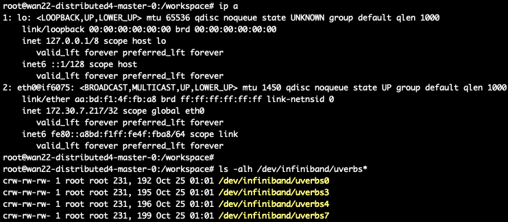

```bash
ls -alh /dev/infiniband/uverbs*
```



好的，你提供的宿主机 (`bjdb-h20-node-080`) 上的 `ibv_devinfo` 和 `ip a` 输出，**彻底揭示了问题的根源！**

### 宿主机信息分析

1.  **`ibv_devinfo` 输出**:
    *   宿主机上存在多个 Mellanox HCA (Host Channel Adapter)，例如 `mlx5_0`, `mlx5_3`, `mlx5_4`, `mlx5_7`。
    *   这些 HCA 的 `link_layer: InfiniBand` 且 `state: PORT_ACTIVE`，表明它们是**活跃的 InfiniBand 接口**。
    *   `mlx5_5` 和 `mlx5_6` 状态是 `PORT_DOWN`，暂时不考虑。
    *   `mlx5_bond_0` 虽然是 `InfiniBand` 传输层，但 `link_layer: Ethernet`，这通常是 RoCE (RDMA over Converged Ethernet) 或其他以太网模式。

2.  **`ip a` 输出**:
    *   宿主机上存在多个 `link/infiniband` 类型的网络接口，例如 `ibs108`, `ibs110`, `ibs112`, `ibs114`。
    *   这些接口 `state: UP`，并且有 IPv6 地址。
    *   这些 `ibsXXX` 接口与 `mlx5_0`, `mlx5_3`, `mlx5_4`, `mlx5_7` 等 HCA 是对应的。

**结论**: 宿主机上**确实存在并活跃着 InfiniBand RDMA 硬件和对应的网络接口**。

### 问题根源确认

结合之前 Pod 内部 `ip a` **没有显示任何 `ibsXXX` 接口**的事实，可以**百分之百确定**：

**虽然 K8s 的设备插件成功地将 RDMA 硬件设备文件 (`/dev/infiniband/uverbs*`) 挂载到了 Pod 内部，但 K8s 的网络配置（CNI）没有将宿主机上的 RDMA 网络接口 (`ibsXXX`) 添加到 Pod 的网络命名空间中。**

因此，NCCL 无法通过 RDMA 网络进行通信，因为它根本看不到 RDMA 接口的 IP 地址，只能回退到 Pod 内部唯一的 `eth0` 接口（Calico 提供的标准 K8s 叠加网络），而这个网络在跨节点通信时性能很差。

### 解决方案：配置 K8s 集群以暴露 RDMA 网络接口

要解决这个问题，你需要 K8s 集群管理员的协助，配置集群以支持 Pod 内部的 RDMA 网络接口。这通常需要以下步骤：

#### 1. 部署 Multus CNI (如果尚未部署)

Multus CNI 允许 Pod 拥有多个网络接口。它是实现 Pod 内部 RDMA 接口暴露的基础。

#### 2. 部署 RDMA CNI 插件

在 Multus CNI 的基础上，你需要部署一个专门的 RDMA CNI 插件。这个插件会与宿主机上的 RDMA 驱动和硬件交互，将 RDMA 接口（通常是 SR-IOV 虚拟功能 VF）添加到 Pod 的网络命名空间中。

*   **常见的 RDMA CNI 插件**: 例如 `k8s-rdma-shared-dev-plugin` 或其他厂商提供的插件。
*   **配置**: 你需要创建 `NetworkAttachmentDefinition` CRD 来定义 RDMA 网络，指定要使用的 HCA 和端口。

#### 3. 修改 `PyTorchJob` YAML 以请求 RDMA 网络接口

一旦集群配置好，你的 `PyTorchJob` YAML 需要修改，以请求 RDMA 网络接口：

*   **请求 RDMA 资源数量**:
    *   你的 Pod 请求 4 块 GPU (`nvidia.com/gpu: "4"`)。
    *   宿主机有 4 个活跃的 InfiniBand 接口 (`ibs108`, `ibs110`, `ibs112`, `ibs114`)。
    *   如果你的分布式策略是每个 GPU 使用一个 RDMA 接口，那么 `t7d.com/rdma: "1"` 是不够的。你需要请求 `t7d.com/rdma: "4"`。
    *   **请与你的 K8s 管理员确认 `t7d.com/rdma` 这个资源具体代表什么**：是一个 HCA 还是一个网络接口？如果是 HCA，那么请求 `1` 个 HCA，CNI 插件应该能暴露该 HCA 上的所有接口。但如果它代表一个网络接口，你就需要请求 `4` 个。

*   **添加 Multus 注解**:
    在 `PyTorchJob` 的 Pod 模板中，添加 Multus CNI 的注解，指定要使用的 RDMA 网络：
    ```yaml
    spec:
      template:
        metadata:
          annotations:
            k8s.v1.cni.cncf.io/networks: <你的RDMA-network-attachment-definition-name> # 例如: "rdma-net"
        spec:
          containers:
            - name: pytorch
              # ... 其他配置 ...
              resources:
                limits:
                  # ...
                  nvidia.com/gpu: "4"
                  t7d.com/rdma: "4" # 如果每个 GPU 需要一个 RDMA 接口，则改为 4
                requests:
                  # ...
                  nvidia.com/gpu: "4"
                  t7d.com/rdma: "4" # 如果每个 GPU 需要一个 RDMA 接口，则改为 4
              env:
                # ... 其他环境变量 ...
                - name: NCCL_IB_HCA
                  value: "mlx5_0" # 替换为你实际使用的 HCA ID，或者根据 CNI 插件的配置来决定
                - name: NCCL_SOCKET_IFNAME
                  value: "ib0" # 替换为 CNI 插件暴露给 Pod 的 RDMA 接口名称，通常是 ib0 或 net1
                - name: NCCL_IB_DISABLE
                  value: "0"
    ```

#### 4. 重新部署并验证

*   在 K8s 集群配置好 RDMA CNI 后，重新部署 `PyTorchJob`。
*   **进入 Pod 内部，运行 `ip a`**。你应该能看到除了 `eth0` 之外，还多了一个或多个 `link/infiniband` 类型的接口（例如 `ib0`）。
*   **检查 NCCL 日志**。此时，你应该能看到 `NCCL INFO NET/IB : Using interface ...` 这样的日志，表明 NCCL 正在使用 RDMA 进行通信。

### 总结

问题已经非常明确：**K8s Pod 内部缺乏 RDMA 网络接口。** 解决这个问题的关键在于 K8s 集群的网络配置，而不是你的 `PyTorchJob` YAML 或 PyTorch 代码本身。你需要与你的 K8s 集群管理员紧密合作，以启用 Pod 内部的 RDMA 网络。