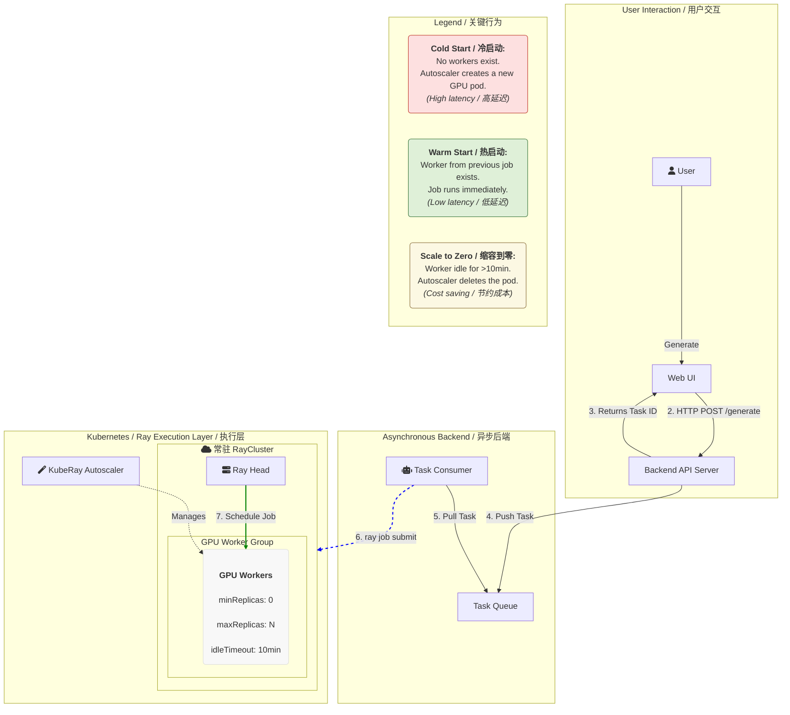

## 1. 核心需求与挑战

1.  **多机多卡分布式推理**: 视频模型体积大，计算量大，单卡无法独立支撑，需要利用多块 GPU 进行分布式推理。
2.  **长耗时、资源密集型任务**: 视频生成是计算密集型任务，单次推理至少需要数分钟，且占用大量 GPU 显存。
3.  **用户交互体验**: 用户发起请求后，需要能够实时查看任务状态和进度，而非长时间等待接口超时。
4.  **成本效益**: GPU 资源昂贵，需避免在无请求时“空烧”资源，实现按需付费或智能缩容。

## 2. 架构模式选择

针对长耗时、资源密集型任务，主要有两种架构模式：

### 2.1 模式一：按需作业模式

*   **描述**: 将每次推理请求视为一个独立的、一次性的批处理作业。当请求到来时，启动一个 Job（如 `PyTorchJob`），任务完成后 Job 自动终止，释放资源。
*   **优点**: 成本控制完美（按需付费），资源利用率高，任务间隔离性强。
*   **缺点**: 每次任务都有较高的启动延迟（Pod 调度、模型加载），不适合对延迟敏感的场景。
*   **适用场景**: 离线批处理、异步任务、对延迟容忍度高的场景。

### 2.2 模式二：长驻服务模式

*   **描述**: 将模型部署为一个持续运行的在线服务。模型在服务启动时加载一次，之后持续监听 HTTP 请求，并对请求进行推理。
*   **优点**: 模型处于“热”状态，推理延迟低，用户体验好。
*   **缺点**: 持续占用资源（特别是 GPU），成本高昂。
*   **适用场景**: 低延迟、高频次、短耗时的在线推理。

### 2.3 长驻服务 vs. 作业模式对比

| 特性               | 长驻服务模式                                                 | 按需作业模式                                                 |
| :----------------- | :----------------------------------------------------------- | :----------------------------------------------------------- |
| **资源占用模式**   | **持续占用**。Pod 启动后就一直运行，GPU 资源被永久性占用，无论有无请求。 | **按需分配**。只有在需要执行任务时才创建 Pod，任务完成后 Pod 销毁，GPU 资源被立即释放。 |
| **响应延迟**       | **极低**。模型已加载到 GPU 显存中，处于“热”状态。请求来了可以直接进行计算，延迟通常在毫秒或秒级。 | **高 (分钟级)**。每个 Job 启动都需要经历：Pod 调度 -> 镜像拉取 -> **模型加载到显存**(1~2 min) -> 计算(~30 min)。其中模型加载是主要耗时。 |
| **成本效益**       | **低**。在请求稀疏或有波峰波谷时，GPU 大量时间在闲置，但依然在为它付费。成本极高。 | **高**。真正实现了“按需付费”，只在计算时才占用昂贵的 GPU 资源，没有请求就没有成本。 |
| **吞吐量与并发**   | 适合处理**大量、快速**的并发请求。可以通过增加 Pod 数量 (replicas) 来水平扩展。 | 适合处理**并行、长耗时**的任务。通过并行创建多个 Job 来实现并发处理，每个 Job 独立运行。 |
| **模型加载**       | **一次性加载**。服务启动时加载一次，后续所有请求复用。       | **每次加载**。每个 Job 启动时都需要重新从存储加载模型。      |
| **稳定性与隔离性** | **较低**。如果某个请求导致推理代码或显存出错，可能导致整个 Pod 崩溃，影响后续所有请求，直到 Pod 重启。 | **高**。每个 Job 都是一个独立的、隔离的运行环境。一个 Job 的失败完全不影响其他并行的或后续的 Job。 |
| **适用场景**       | **低延迟、高频次、短耗时**的在线推理。例如：人脸识别、文本翻译、图片分类、实时推荐。 | **高延迟容忍、低频次、长耗时**的批处理任务。例如：**视频生成**、模型训练、批量数据处理、科学计算。 |

## 3. 详细方案对比与选型

### 3.1 方案一：基于 PyTorchJob 的作业模式

*   **核心思路**: 后端 API 接收请求后，将任务推送到异步队列。Worker 从队列中取出任务，然后通过 `client-go` 创建一个 `PyTorchJob`。`PyTorchJob` 负责启动多机多卡分布式推理，完成后将结果上传 S3。
*   **多机多卡实现**: `PyTorchJob` 天然支持多机多卡。`torchrun` 会在多个 Pod 之间自动协调 `torch.distributed` 进程组。
*   **优点**: 
    *   **成本效益极高**: GPU 资源按需使用，任务完成后立即释放。
    *   **架构简单**:  `PyTorchJob` 的使用简单。
    *   **鲁棒性强**: 任务间隔离，一个任务失败不影响其他。
    *   **复用度高**: `generate.py` 可直接作为 `PyTorchJob` 的入口脚本。
*   **缺点**: 
    *   **用户体验有延迟**: 每次任务都有 Pod 调度、模型加载等冷启动时间，用户需等待数分钟。
*   **适用场景**: **初期快速上线、成本敏感、用户对视频生成有一定延迟容忍度的体验中心。**

### 3.2 方案二：基于 RayJob 的作业模式

*   **核心思路**: 与 `PyTorchJob` 类似，后端 API 接收到请求后，创建一个 `RayJob` 资源。`RayJob` 会将推理脚本（`generate_ray.py`）提交到一个预先存在或按需创建的 Ray Cluster 中执行。任务完成后，`RayJob` 结束，计算资源可以被 Ray Cluster 的 AutoScaler 回收。
*   **多机多卡实现**:
    *   通过 KubeRay Operator 部署和管理 Ray Cluster，该集群管理所有节点和 GPU 资源。
    *   `RayJob` 将一个 Python 脚本提交到 Ray Cluster 的 Head Pod。
    *   脚本内部使用 Ray 的原生分布式原语（如 `@ray.remote` 定义 Actor，并通过 `placement_group` 指定资源布局）来精细化地控制多机多卡推理的执行过程。
*   **优点**:
    *   **执行效率高**: 如果 Ray Cluster 是“热”的（模型文件已加载），`RayJob` 的启动延迟远低于 `PyTorchJob`，因为它无需等待新的 Pod 调度和模型加载，只需将代码提交到现有环境中执行，但是这种模式也会占用大量 GPU 显存，需要权衡。
    *   **灵活性强**: Ray 提供了比 `torchrun` 更灵活、更强大的分布式编程模型。可以轻松实现复杂的依赖关系、任务图谱和自定义的资源分配策略。
*   **缺点**:
    *   **架构更重**: 需要额外部署和维护一个常备 Ray Cluster 来换取作业的快速启动，相比 `PyTorchJob` 这种更“原生”的 Kubernetes Job 资源，增加了一层复杂性。
    *   **代码改造成本**: 需要将原生的 `torch.distributed` 脚本（`generate.py`）改造为使用 Ray API 的形式（`generate_ray.py`），有一定学习和开发成本。
*   **适用场景**: **对启动延迟有一定要求（希望比 `PyTorchJob` 快），同时需要更灵活的分布式控制，或已熟悉 Ray 生态的团队。**

### 3.3 作业模式 PyTorchJob vs. RayJob

| 特性             | PyTorchJob                                               | RayJob                                                       |
| :--------------- | :------------------------------------------------------- | :----------------------------------------------------------- |
| **核心抽象**     | 一组协同工作的 Kubernetes Pod                            | 提交到 Ray Cluster 的一次性作业                              |
| **分布式实现**   | `torchrun` + `torch.distributed`                         | Ray Core API (`@ray.remote`, `placement_group`)              |
| **启动延迟**     | **高** (Pod 调度、镜像拉取、存储挂载)                    | **中/低** (如果 Cluster 已存在，则延迟很低)                  |
| **成本效益**     | **高** (纯粹的按需付费）                                 | **中/低** (维需护一个常备集群来换取作业的快速启动，带来持续的、较低的闲置成本) |
| **架构复杂度**   | **低** (Kubernetes 原生 Job)                             | **高** (需额外部署和管理 KubeRay 和 RayCluster)              |
| **代码侵入性**   | **低** (可直接使用标准 `torchrun` 脚本)                  | **中** (需将代码适配 Ray 的分布式 API)                       |
| **灵活性与控制** | **标准** (由 `torchrun` 和 `PyTorchJob` controller 决定) | **高** (可编程的、精细的任务和资源控制)                      |
| **生态系统**     | 专注于 PyTorch 分布式任务                                | 统一的数据、训练、推理、服务平台                             |

### 3.4 方案三：基于 Ray Serve 的长驻服务模式

*   **核心思路**: 利用 Ray Cluster 的原生分布式能力和 Ray Serve 的模型服务框架。后端 API 直接调用 Ray Serve 暴露的模型服务接口。
*   **多机多卡实现**: 
    *   部署一个多节点的 Ray Cluster（通过 KubeRay Operator），它本身就管理着多机多卡的资源。
    *   Ray Serve 将模型部署为多个 Ray Actor，每个 Actor 可以请求 GPU。Ray 会自动将这些 Actor 分布到 Ray Cluster 的不同节点和 GPU 上。
    *   可以在 Ray Actor 内部使用 `torch.distributed` 或 Ray 的分布式原语来管理模型副本和数据分发。
    *   Ray Serve 提供了 `placement_group` 等功能，确保分布式组件的协同。
*   **优点**: 
    *   **原生分布式**: Ray 的设计理念就是分布式，多机多卡配置更自然、灵活。
    *   **高度灵活**: 可以精细控制模型的部署拓扑、资源分配和请求处理逻辑。
    *   **统一生态**: 如果未来有训练、数据处理等其他分布式任务，Ray 提供统一平台。
*   **缺点**: 
    *   需要学习 Ray 和 Ray Serve 的编程模型和部署方式。
    *   Ray Cluster 的部署和管理需要一定经验。
    *   重构: `generate.py` 需重构为 Ray Serve 的 Actor 格式。
*   **适用场景**: **对分布式模型服务有高度定制化需求、希望在统一平台管理所有 ML 工作流、或已熟悉 Ray 生态的场景。**

### 3.5 方案四：基于 TorchServe 的长驻服务模式（不支持多机）

*   **核心思路**: 底层推理引擎使用 PyTorch 官方的 TorchServe。后端 API 直接调用框架暴露的标准模型服务接口。
*   **多机多卡实现**: 
    *   需要将模型和自定义的 Python 处理逻辑（`handler`）打包成一个 `.mar` 文件。
    *   将这个 `.mar` 文件部署到 TorchServe 服务器上，它会自动暴露为 REST 或 gRPC API。
    *   TorchServe 自身支持在**单机多卡**上进行模型并行或数据并行，可以指定一个模型在多个 GPU 上加载。
*   **缺点**: 
    *   **不支持多机**: 它天生是为“无状态、可复制的”模型推理设计的，即一个请求由一个（可能利用了单机多卡的）副本处理。它**没有内置的、原生的机制来为一个请求去协调一个跨越多台机器的 `torch.distributed` 进程组**。强行改造以支持此模式，复杂度极高，得不偿失。

### 3.6 长驻服务模式 TorchServe vs. RayServe

| 特性                             | TorchServe                         | Ray Serve                                                    |
| :------------------------------- | :--------------------------------- | :----------------------------------------------------------- |
| **核心抽象**                     | 模型处理器 (Model Handler)         | 分布式 Actor/任务 (Distributed Actor/Task)                   |
| **设计目标**                     | 高效地加载和**服务单个模型**       | 高效地**执行和编排任意分布式代码**                           |
| **伸缩单元**                     | 独立的、无状态的 Worker 进程       | 可互相通信、有状态的 Actor 组                                |
| **多机多卡 `torch.distributed`** | **不支持** (非原生设计目标)        | **原生支持** (核心功能)                                      |
| **实现方式**                     | 无法为一个请求动态组建跨节点进程组 | 可为一个服务动态创建/管理一个跨节点的 Actor 组，并在组内初始化 `torch.distributed` |
| **适用场景**                     | 适用于模型可被独立复制的场景       | **适用于需要多进程/多节点协作完成单次请求的场景**            |

## 4. 综合方案：RayCluster + RayJobs + 任务队列

这是将我们之前探讨过的所有组件优点结合起来的**混合架构**，是解决此类问题的行业标准方案。

**架构图景：**

1.  **前端 (Web UI)**：用户点击“生成”。
2.  **后端 API**：
    *   接收到 HTTP 请求。
    *   **不做实际计算**。而是将用户的请求（比如文本提示、风格参数）作为一个**任务**，放入一个**任务队列**中（如 RabbitMQ, Redis Stream）。
    *   立即向用户返回一个任务 ID，并告知“您的视频正在生成中，请稍后查看”。
3.  **常驻的 `RayCluster`**：
    *   部署一个**长期运行**的 `RayCluster`。
    *   关键配置：Worker 组使用 GPU 节点，并设置 `minReplicas: 0` 和 `maxReplicas: N`，同时开启 `enableInTreeAutoscaling: true`。**但是，设置一个较长的 `idleTimeoutSeconds`**（例如 10-15 分钟）。
4.  **任务消费者**：
    *   这是一个独立的、长期运行的进程。
    *   它不断地从任务队列中拉取任务。
    *   每拉取一个任务，它就使用 **`ray job submit`** 将这个生成任务提交到**上述已经存在的 `RayCluster`**。

**工作流程与优势分析：**

*   **第一个用户到来时**：
    1.  API 将任务放入队列。
    2.  任务消费者从队列取出任务，通过 `RayJob` 提交给 `RayCluster`。
    3.  `RayCluster` 的 Autoscaler 发现没有 GPU Worker，于是从 0 开始拉起第一个 GPU Pod。
    4.  **是的，第一个用户仍然会经历一次较长的冷启动**。但由于后端是异步的，用户已经收到了“正在处理”的反馈，体验比同步等待要好。

*   **后续用户（在 10-15 分钟内）到来时**：
    1.  API 将新任务放入队列。
    2.  任务消费者取出任务，提交给 `RayCluster`。
    3.  此时，**上一个任务留下的 GPU Pod 还因为 `idleTimeoutSeconds` 较长而存活**！
    4.  Ray Jobs 系统发现有现成的、热的 GPU 资源，**立即开始执行计算**，几乎没有延迟。
    5.  **这极大地提升了“热”用户的效率**。

*   **流量低谷期（超过 15 分钟无人使用）**：
    1.  `idleTimeoutSeconds` 到期。
    2.  KubeRay Autoscaler 自动将所有 GPU Worker Pod 缩容到 0。
    3.  **成本降为零**。

**结论（选型推荐）：**

对于文生视频这种“重计算、按需、交互式”的应用，最佳选型是：

**一个配置了自动伸缩（`minReplicas: 0`）和较长空闲超时（`idleTimeoutSeconds`）的常驻 `RayCluster`，结合一个后端的任务队列和 Ray Jobs 来进行任务的异步提交。**

这种架构完美地平衡了三者：

*   **成本**：通过 `minReplicas: 0` 和自动缩容保证了无人使用时零成本。
*   **效率**：通过较长的 `idleTimeoutSeconds` 实现了对“突发”用户的“资源复用”，大大降低了平均启动延迟。
*   **用户体验**：通过异步任务队列，将前端交互与后端重计算解耦，提供了更好的即时反馈。